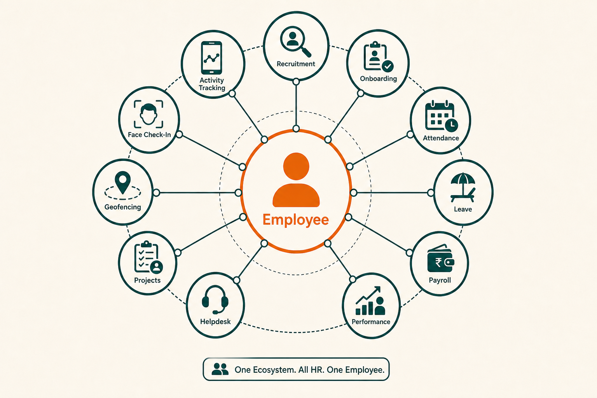

# الباقات

يُباع Social HR عبر **[باقات اشتراك](./PLATFORM.md)** تجمع [وحدات](./MODULES.md) الموارد البشرية. تُعيَّن لكل مساحة عمل عميل باقة واحدة تحدّد الميزات الظاهرة والقابلة للاستخدام.

يمكن لـ [مشغّلي المنصة](./ROLES_AND_PERMISSIONS.md#platform-operator) أيضاً تطبيق **[تجاوزات الوحدات لكل عميل](./PLATFORM.md)** لتفعيل وحدات محددة أو تعطيلها خارج افتراضيات الباقة — مفيد للتجارب التجريبية والصفقات المخصّصة أو القيود المؤقتة.

> **نظرة سريعة**
>
> | الباقة | الأنسب لـ | عدد الوحدات (افتراضي) | إضافات رئيسية مقارنة بالمستوى السابق |
> |--------|-----------|------------------------|--------------------------------------|
> | **Trial** | التقييم وPOC | 4 | الموارد البشرية الأساسية: Employees، Attendance، Leave، Face Check-In |
> | **Standard** | المؤسسات النامية | 14 | عمليات موارد بشرية كاملة + Activity Tracking، Payroll، Recruitment |
> | **Enterprise** | احتياجات الموقع والأجهزة | 16 | [Geofencing](./MODULES.md#geofencing)، [Biometric Devices](./MODULES.md#biometric-devices) |

---

## كيف تعمل الباقات

عند فتح العميل لمساحة عمل الموارد البشرية:

1. يبحث النظام عن [الباقة](./PLATFORM.md) المعيّنة ويحمّل [الوحدات](./PLATFORM.md) المضمّنة فيها.
2. تُطبَّق أي [تجاوزات لكل عميل](#per-customer-module-overrides) (إجبار التفعيل، إجبار التعطيل، أو العودة لافتراضي الباقة).
3. يتحكّم مجموع الوحدات الناتجة في ظهور الشريط الجانبي والوصول للميزات.
4. الوحدات المعطّلة **مخفية ومحظورة** — لا يمكن للمستخدمين الوصول إليها حتى عبر رابط مباشر.

تسري تغييرات الباقة فوراً عند الطلب التالي للعميل. لا حاجة لإعادة تجهيز مساحة العمل. راجع [كيف يعمل — تغييرات الباقة](./HOW_IT_WORKS.md#plan-changes-and-module-visibility).

---

## الباقات الافتراضية

يُوفّر Social HR ثلاث مستويات باقة. يمكن لفريق المنصة إنشاء باقات إضافية أو تعديل تعيينات الوحدات.

### Trial {#trial}

**الغرض:** التقييم وإثبات المفهوم للعملاء المحتملين.

**الوحدات المضمّنة عادةً:**

| الوحدة | مضمّنة |
|--------|--------|
| [Employees](./MODULES.md#employees) | ✓ |
| [Attendance](./MODULES.md#attendance) | ✓ |
| [Leave](./MODULES.md#leave) | ✓ |
| [Face Check-In](./MODULES.md#face-check-in) | ✓ |

**غير مضمّنة في Trial الافتراضي:** Recruitment، Onboarding، Payroll، Performance، Offboarding، Assets، Helpdesk، Projects، Geofencing، Biometric Devices، Activity Tracking، Documents.

Trial هي **الباقة الافتراضية** لمساحات العمل [المُجهَّزة](./PLATFORM.md) حديثاً ما لم تُختَر باقة أخرى.

**من يستفيد:** فرق المبيعات في التقييمات السريعة؛ قادة الموارد البشرية لاختبار الحضور والانصراف والإجازات قبل الالتزام.

**سير العمل المعتاد:** [حالات الاستخدام — تجهيز Trial جديد لعميل](./USE_CASES.md#provision-a-new-customer-trial).

### Standard

**الغرض:** عمليات موارد بشرية كاملة لمعظم المؤسسات النامية.

**يتضمّن كل ما في Trial، بالإضافة إلى:**

| الوحدة | مضمّنة |
|--------|--------|
| [Recruitment](./MODULES.md#recruitment) | ✓ |
| [Onboarding](./MODULES.md#onboarding) | ✓ |
| [Payroll](./MODULES.md#payroll) | ✓ |
| [Performance (PMS)](./MODULES.md#performance-pms) | ✓ |
| [Offboarding](./MODULES.md#offboarding) | ✓ |
| [Assets](./MODULES.md#assets) | ✓ |
| [Helpdesk](./MODULES.md#helpdesk) | ✓ |
| [Projects](./MODULES.md#projects) | ✓ |
| [Activity Tracking](./MODULES.md#activity-tracking) | ✓ |
| [Documents](./MODULES.md#documents) | ✓ |

**غير مضمّنة في Standard الافتراضي:** [Geofencing](./MODULES.md#geofencing)، [Biometric Devices](./MODULES.md#biometric-devices).

**من يستفيد:** المؤسسات التي تحتاج موارد بشرية من التوظيف إلى الرواتب دون فرض الموقع أو أجهزة البصمة.

**سير العمل المعتاد:** [حالات الاستخدام — الترقية إلى Standard](./USE_CASES.md#upgrade-a-customer-to-standard).

### Enterprise

**الغرض:** وصول كامل للمنصة بما في ذلك فرض الموقع وتكاملات الأجهزة.

**يتضمّن كل الـ 16 وحدة في الفهرس:**

| الوحدة | مضمّنة |
|--------|--------|
| كل وحدات Standard | ✓ |
| [Geofencing](./MODULES.md#geofencing) | ✓ |
| [Biometric Devices](./MODULES.md#biometric-devices) | ✓ |

**من يستفيد:** المؤسسات ذات القوى العاملة المكتبية التي تحتاج فرض [السياج الجغرافي](./FEATURES.md#geofencing-and-work-type-location-policies)، أو من تستخدم أجهزة بصمة/وجه.

**سير العمل المعتاد:** [حالات الاستخدام — إعداد Geofencing للمكتب](./USE_CASES.md#configure-office-geofencing).

---

## فهرس الوحدات الكامل {#full-module-catalog}

ست عشرة وحدة متاحة عبر الباقات. راجع [الوحدات](./MODULES.md) لوصف تفصيلي لكل وحدة.

| الوحدة | Trial | Standard | Enterprise |
|--------|-------|----------|------------|
| [Employees](./MODULES.md#employees) | ✓ | ✓ | ✓ |
| [Attendance](./MODULES.md#attendance) | ✓ | ✓ | ✓ |
| [Leave](./MODULES.md#leave) | ✓ | ✓ | ✓ |
| [Face Check-In](./MODULES.md#face-check-in) | ✓ | ✓ | ✓ |
| [Recruitment](./MODULES.md#recruitment) | — | ✓ | ✓ |
| [Onboarding](./MODULES.md#onboarding) | — | ✓ | ✓ |
| [Payroll](./MODULES.md#payroll) | — | ✓ | ✓ |
| [Performance (PMS)](./MODULES.md#performance-pms) | — | ✓ | ✓ |
| [Offboarding](./MODULES.md#offboarding) | — | ✓ | ✓ |
| [Assets](./MODULES.md#assets) | — | ✓ | ✓ |
| [Helpdesk](./MODULES.md#helpdesk) | — | ✓ | ✓ |
| [Projects](./MODULES.md#projects) | — | ✓ | ✓ |
| [Activity Tracking](./MODULES.md#activity-tracking) | — | ✓ | ✓ |
| [Documents](./MODULES.md#documents) | — | ✓ | ✓ |
| [Geofencing](./MODULES.md#geofencing) | — | — | ✓ |
| [Biometric Devices](./MODULES.md#biometric-devices) | — | — | ✓ |

✓ = مضمّنة في البذرة الافتراضية للباقة. [تجاوزات لكل عميل](#per-customer-module-overrides) يمكنها تغيير أي تعيين.

---

## تجاوزات الوحدات لكل عميل {#per-customer-module-overrides}

يمكن لفريق المنصة تجاوز افتراضيات الباقة لعملاء محددين:

| التجاوز | الأثر |
|---------|-------|
| **إجبار التفعيل** | الوحدة متاحة حتى لو لم تكن في باقة العميل |
| **إجبار التعطيل** | الوحدة مخفية ومحظورة حتى لو كانت في باقة العميل |
| **إزالة التجاوز** | العودة لافتراضي الباقة |

**حالات استخدام شائعة:**

- تفعيل [Activity Tracking](./MODULES.md#activity-tracking) لعميل Trial في برنامج تجريبي
- إجبار [Geofencing](./MODULES.md#geofencing) لعميل يقيّم Enterprise قبل ترقية الباقة
- تعطيل [Projects](./MODULES.md#projects) لعميل اشترى Standard ولا يحتاج إدارة المشاريع

تسري التجاوزات عند تحميل الصفحة التالية للعميل.

---

## قواعد خاصة للوحدات

### Face Check-In وAttendance

[Attendance](./MODULES.md#attendance) و[Face Check-In](./MODULES.md#face-check-in) **استحقاقان منفصلان**. إذا كان لدى العميل Attendance دون Face Check-In، تكون ميزات التحقق بالوجه غير متاحة رغم مشاركة سير عمل الحضور والانصراف. يتيح ذلك استخدام الحضور والانصراف دون نشر بنية التحقق بالوجه.

### إعداد Geofencing مقابل الاستحقاق

يجب أن يكون [Geofencing](./MODULES.md#geofencing) **مستحقاً** (في الباقة أو مفعّلاً بتجاوز) **ومُعدّاً** من مدير الموارد البشرية للعميل (إحداثيات المكتب، نصف القطر، التفعيل). الاستحقاق وحده لا يفرض قواعد الموقع. السياسة: [Geofencing والموقع](./POLICIES.md#geofencing-and-location).

---

## حدود الباقة — مخزّنة وغير مُطبَّقة {#plan-limits--stored-but-not-enforced}

توجد هذه الحقول للاستخدام المستقبلي لكن **لا تُطبَّق فعلياً** في المنتج اليوم:

| الحد | الحالة |
|------|--------|
| **الحد الأقصى للموظفين** | مخزّن على الباقة؛ لا حظر تلقائي عند تجاوزه |
| **مدة Trial (أيام)** | إرشادي؛ لا تحويل أو انتهاء تلقائي |
| **الفوترة الآلية** | غير مُنفَّذة؛ تغييرات حالة الحساب يدوية |

يجب على فرق المبيعات والتهيئة التعامل مع حدود الموظفين ك**إرشاد للتعبئة**، وليس كفرض صارم في المنتج. يدير فريق المنصة تحويل Trial والإيقاف يدوياً عبر [لوحة التحكم](./PLATFORM.md).

---

## الترقية والتخفيض {#upgrading-and-downgrading}

### الترقية (Trial → Standard → Enterprise)

1. يغيّر فريق المنصة الباقة في [لوحة التحكم](./PLATFORM.md).
2. تظهر الوحدات الجديدة في الشريط الجانبي للعميل فوراً.
3. لا حاجة لترحيل بيانات — الوحدات كانت موجودة دائماً في بنية المنتج.
4. قد يحتاج مدير الموارد البشرية للعميل إلى إعداد الوحدات الجديدة (إحداثيات [Geofence](./FEATURES.md#geofencing-and-work-type-location-policies)، [سياسات النشاط](./FEATURES.md#activity-tracking-desktop-monitoring)، عقود [Payroll](./FEATURES.md#payroll)، إلخ).

### التخفيض أو الإيقاف

1. يغيّر فريق المنصة الباقة أو يضبط الحالة على suspended.
2. تختفي الوحدات المُزالة من التنقل وتصبح غير متاحة.
3. بيانات الوحدات المعطّلة **محفوظة** في مساحة العمل.
4. لا يمكن للعملاء الموقوفين تسجيل الدخول؛ تبقى البيانات حتى إعادة التفعيل أو الحذف.

السيناريو: [حالات الاستخدام — إيقاف حساب متأخر السداد](./USE_CASES.md#suspend-a-non-paying-account).

---

## مستندات ذات صلة

- [الوحدات](./MODULES.md) — ما تفعله كل وحدة
- [المنصة](./PLATFORM.md) — كيف يدير فريق المنصة الباقات
- [السياسات — الوصول إلى الحساب](./POLICIES.md#account-access-and-entitlements) — قواعد فرض الاستحقاق
- [الميزات](./FEATURES.md) — شرح تفصيلي للقدرات حسب الوحدة
- [حالات الاستخدام](./USE_CASES.md) — سيناريوهات تغيير الباقة
- [المنصة](./PLATFORM.md) — سياق الباقة والوحدة والاستحقاق
