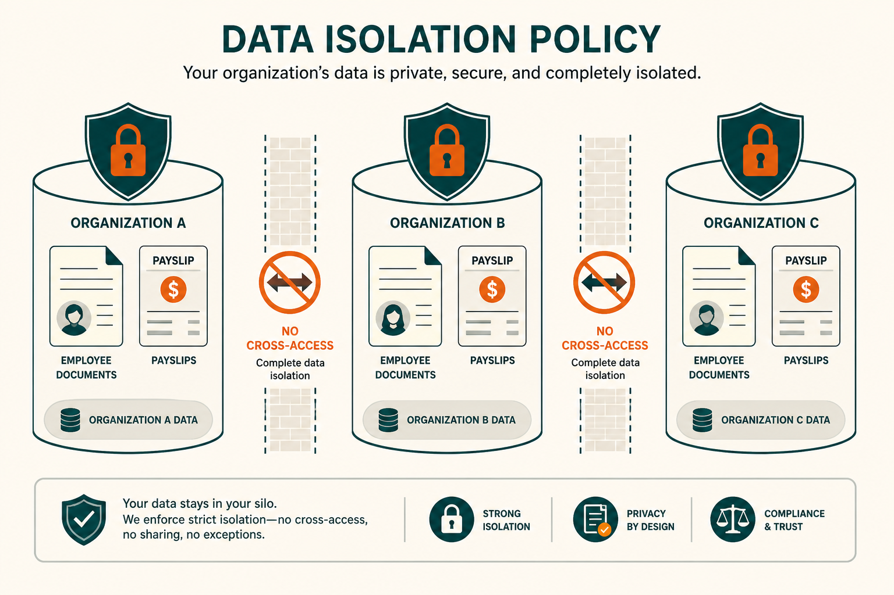
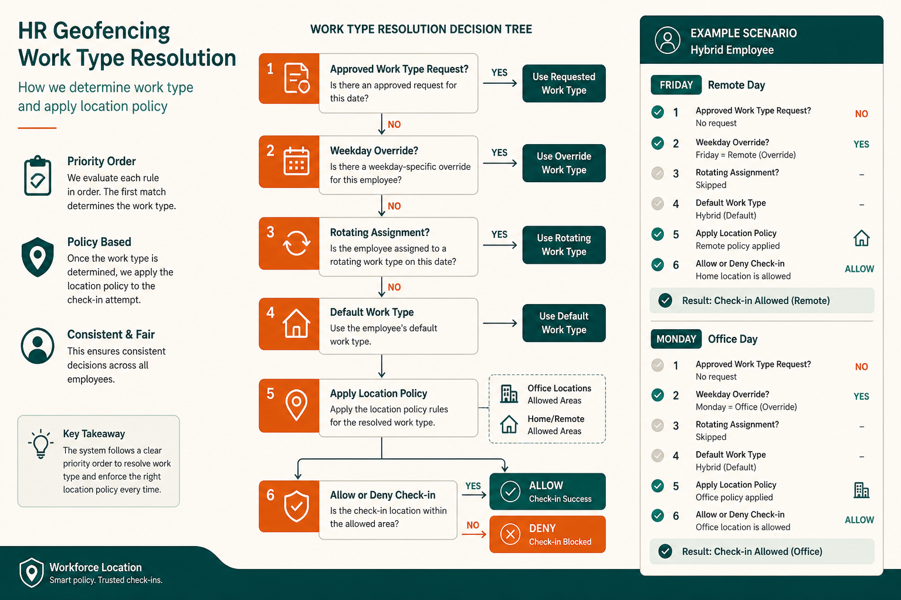
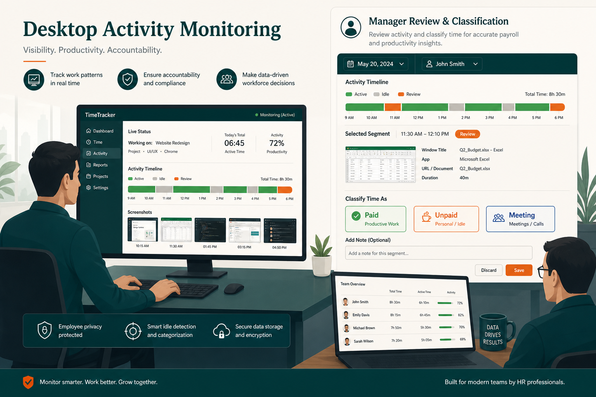
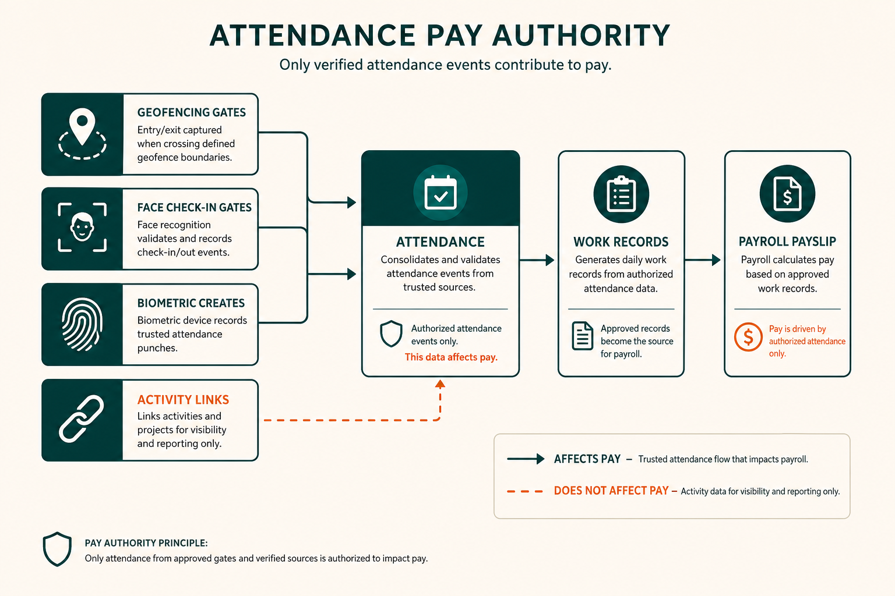

# السياسات

القواعد والسياسات كما تختبرها المؤسسات في Social HR. يصف هذا المستند **ما يفرضه النظام**، **ما يضبطه المسؤولون**، و**ما لا يفعله النظام صراحةً**.

السياسات هنا تعكس السلوك المُطبَّق — وليست أدلة موارد بشرية طموحة. [مسؤولو المؤسسة (Tenant admin)](./ROLES_AND_PERMISSIONS.md#tenant-admin) يضبطون العتبات والمفاتيح؛ هذا المستند يشرح القواعد الناتجة.

> **نظرة سريعة**
>
> | مجال السياسة | يُفرَض بواسطة | يُضبَط بواسطة |
> |-------------|---------------|---------------|
> | [عزل البيانات](#data-isolation-and-privacy) | بنية المنصة | — |
> | [الوصول للحساب](#account-access-and-entitlements) | حالة [لوحة التحكم (Control plane)](./PLATFORM.md) + [الباقة (Plan)](./PLANS.md) | مشغّل المنصة |
> | [السياج الجغرافي (Geofencing)](#geofencing-and-location) | تقييم تسجيل الحضور | مسؤول الموارد البشرية |
> | [تتبع النشاط (Activity tracking)](#activity-tracking) | تصنيف المقاطع | مسؤول الموارد البشرية + المدير |
> | [الحضور والانصراف والراتب](#attendance) | سير عمل التحقق | مسؤول الموارد البشرية + المدير |

تفاصيل الميزات: [الميزات](./FEATURES.md). المبررات: [قرارات التصميم](./DESIGN_DECISIONS.md).

---

## عزل البيانات والخصوصية {#data-isolation-and-privacy}

| السياسة | ما تختبره المؤسسات |
|--------|---------------------|
| **[عزل مساحة العمل (Workspace isolation)](./PLATFORM.md)** | بيانات كل مؤسسة عميلة منفصلة بالكامل. لا يمكن لمستخدم في مساحة عمل أن يرى موظفي أو سجلات أو ملفات مؤسسة أخرى. |
| **فصل الملفات** | المستندات والصور ولقطات الشاشة المرفوعة تُخزَّن في مساحة اسم (namespace) مخصّصة لتلك المؤسسة. |
| **حسابات مستخدمين منفصلة** | مستخدمو مساحة عمل لا يمكنهم تسجيل الدخول إلى أخرى، حتى بنفس البريد الإلكتروني. |
| **مؤسسة واحدة لكل مساحة عمل** | لا يوجد مبدّل شركات (Company switcher). كل مساحة عمل تمثّل مؤسسة واحدة بالضبط. |

المبرر: [قرارات التصميم — مساحة عمل معزولة لكل عميل](./DESIGN_DECISIONS.md#isolated-workspace-per-customer)، [ملفات بمساحة اسم لكل عميل](./DESIGN_DECISIONS.md#files-namespaced-per-customer).

تفاصيل المنصة: [المنصة — عزل البيانات والملفات](./PLATFORM.md#data-and-file-isolation).

---

## الوصول للحساب والاستحقاقات {#account-access-and-entitlements}

| السياسة | ما تختبره المؤسسات |
|--------|---------------------|
| **حساب موقوف (Suspended)** | يُخرَج جميع المستخدمين ولا يمكنهم تسجيل الدخول. البيانات محفوظة. رسالة توضّح الإيقاف. |
| **حساب ملغى (Cancelled)** | كالموقوف — تسجيل الدخول محظور، البيانات محفوظة حتى الحذف. |
| **[وحدة (Module)](./PLATFORM.md) معطّلة** | الوحدة مخفية من التنقل وغير متاحة حتى عبر الرابط المباشر. بيانات الوحدة محفوظة. |
| **تغيير [الباقة (Plan)](./PLANS.md)** | ظهور الوحدات يتحدّث عند تحميل الصفحة التالية. لا فقدان بيانات عند الترقية أو التخفيض. |
| **تسجيل الحضور بالوجه (Face check-in) بدون استحقاق** | إذا كان [الحضور والانصراف (Attendance)](./MODULES.md#attendance) مفعّلاً لكن [تسجيل الحضور بالوجه](./MODULES.md#face-check-in) غير مشمول في الباقة، ميزات التحقق من الوجه غير متاحة. |

سيناريو: [حالات الاستخدام — إيقاف حساب غير مسدّد](./USE_CASES.md#suspend-a-non-paying-account).

---

## السياج الجغرافي والموقع {#geofencing-and-location}

| السياسة | القاعدة |
|--------|---------|
| **[السياج الجغرافي (Geofence)](./FEATURES.md#geofencing-and-work-type-location-policies) غير نشط** | عندما لا يفعّله مسؤول الموارد البشرية، تمرّ جميع فحوصات الموقع — لا إنفاذ. |
| **[تجاوز السياج الجغرافي (Bypass geofence)](./FEATURES.md#geofencing-and-work-type-location-policies)** | يمكن للموارد البشرية تمييز موظفين لتخطّي فحوصات الموقع بالكامل (سفر تنفيذي، ترتيبات خاصة). |
| **سياسة [نوع العمل (Work type)](./FEATURES.md#geofencing-and-work-type-location-policies)** | لكل نوع عمل أحد ثلاث قواعد: يتطلب التواجد داخل السياج، السماح من أي مكان، أو حظر تسجيل الحضور. |
| **[نوع العمل الفعّال (Effective work type)](./FEATURES.md#geofencing-and-work-type-location-policies)** | يحدّد النظام نوع عمل اليوم عبر: طلب معتمد ← تجاوز يوم الأسبوع ← تعيين متناوب ← الافتراضي. |
| **GPS مطلوب** | «يتطلب التواجد داخل السياج» يرفض تسجيل الحضور إذا لم يوفّر الجهاز إحداثيات الموقع. |
| **سجل تدقيق (Audit trail)** | كل تقييم موقع يُسجَّل — نجاحاً أو فشلاً — للمراجعة. |
| **مصدر الراتب (Pay authority)** | السياج الجغرافي يتحكّم بتسجيل الحضور فقط. لا يحسب ولا يعدّل ساعات الراتب. |

**سياسات الموقع الافتراضية لأنواع العمل:**

| نوع العمل | سياسة الموقع الافتراضية |
|-----------|-------------------------|
| مكتبي (Office) | يتطلب التواجد داخل السياج |
| عن بُعد (Remote) | السماح من أي مكان |
| هجين (Hybrid) | يتطلب التواجد داخل السياج |
| ميداني (Field) | السماح من أي مكان |

يمكن لمسؤولي الموارد البشرية تغيير السياسات على أي نوع عمل بعد إنشائه.

الميزة: [السياج الجغرافي](./FEATURES.md#geofencing-and-work-type-location-policies). الوحدة: [Geofencing](./MODULES.md#geofencing). التدفق: [تحديد نوع العمل](./HOW_IT_WORKS.md#work-type-resolution).

---

## تسجيل الحضور بالوجه {#face-check-in}

| السياسة | القاعدة |
|--------|---------|
| **التفعيل** | يجب على مسؤول الموارد البشرية تفعيل تسجيل الحضور بالوجه في الإعدادات. |
| **[الحد الأدنى للتسجيل (Enrollment minimum)](./FEATURES.md#geofencing-and-work-type-location-policies)** | يجب على الموظفين إكمال ثلاث التقاطات وجه ناجحة على الأقل قبل عمل التحقق. |
| **التحقق عند تسجيل الحضور** | التقاط مباشر من كاميرا الويب يُقارَن بقوالب التسجيل. |
| **وضع الإنفاذ (Enforcement mode)** | يمكن للموارد البشرية اشتراط التحقق من الوجه في كل تسجيل حضور. |
| **الخصوصية** | النظام يخزّن قوالب وجه رياضية، وليس صور التسجيل. |
| **عدم التطابق** | يمكن للموظف إعادة المحاولة أو تقديم طلب إعادة تسجيل للمراجعة. |
| **متطلب الباقة** | يجب أن يكون تسجيل الحضور بالوجه مشمولاً في [باقة](./PLANS.md) المؤسسة (متاح في جميع الباقات الافتراضية). |

الميزة: [تسجيل الحضور بالوجه](./FEATURES.md#face-check-in). المبرر: [قرارات التصميم — التحقق من الوجه](./DESIGN_DECISIONS.md#face-verification-as-an-optional-gate).

---

## تتبع النشاط {#activity-tracking}

| السياسة | القاعدة | الافتراضي |
|--------|---------|-----------|
| **سياسة واحدة لكل مؤسسة** | إعداد تتبع نشاط واحد ينطبق على جميع الموظفين. | يُنشأ تلقائياً |
| **تصنيف الخمول (Idle)** | لا إدخال لوحة مفاتيح/فأرة للمدة المضبوطة ← [مقطع خمول (Idle segment)](./FEATURES.md#geofencing-and-work-type-location-policies). | 5 دقائق |
| **يتطلب مراجعة (Review required)** | الخمول يتجاوز عتبة المراجعة ← يُعلَّم لقرار المدير. | 15 دقيقة |
| **الخمول والراتب** | وقت الخمول **لا** يقلّل تلقائياً [الحضور والانصراف](./MODULES.md#attendance) أو ساعات قسيمة الراتب. | — |
| **[قرارات المدير (Manager decisions)](./FEATURES.md#geofencing-and-work-type-location-policies)** | مقاطع المراجعة تتطلب تصنيفاً: مدفوع (Paid)، غير مدفوع (Unpaid)، أو اجتماع (Meeting). | — |
| **[درجة الإنتاجية (Productivity score)](./FEATURES.md#geofencing-and-work-type-location-policies)** | تُحسب للعرض فقط — لا تظهر أبداً في قسائم الراتب. | — |
| **لقطات الشاشة (Screenshots)** | اختيارية؛ يمكن تعطيلها بالكامل. | مفعّلة، كل 5 دقائق |
| **الاحتفاظ بلقطات الشاشة** | لقطات أقدم من الأيام المضبوطة تُحذف. | 30 يوماً |
| **الربط بتسجيل الحضور** | يمكن للمؤسسة تشجيع استخدام تطبيق سطح المكتب عند تسجيل الحضور. | معطّل افتراضياً |
| **ربط الجلسة** | جلسة النشاط ترتبط تلقائياً بسجل حضور مفتوح عندما يكون الموظف مسجّل حضوره. | تلقائي |

الميزة: [تتبع النشاط](./FEATURES.md#activity-tracking-desktop-monitoring). المبرر: [الحضور مصدر الراتب](./DESIGN_DECISIONS.md#attendance-drives-pay-activity-provides-oversight).

---

## الحضور والانصراف {#attendance}

| السياسة | القاعدة |
|--------|---------|
| **[مصدر الراتب (Pay authority)](./MODULES.md#attendance)** | سجلات الحضور و[سجلات العمل (Work records)](./MODULES.md#attendance) هي المصدر لحساب ساعات الرواتب. |
| **[سير عمل التحقق (Validation workflow)](./MODULES.md#attendance)** | المديرون يراجعون ويتحققون من الحضور قبل الرواتب (عملية مؤسسية). |
| **[فترة السماح (Grace time)](./MODULES.md#attendance)** | تسامح قابل للضبط للتأخر قبل التعليم. |
| **تقييد IP** | قائمة سماح اختيارية — تسجيل الحضور مسموح فقط من عناوين IP محددة. |
| **[طلب حضور (Attendance request)](./MODULES.md#attendance)** | يمكن للموظفين طلب تصحيحات حضور؛ المديرون يوافقون أو يرفضون. |
| **[أجهزة البصمة (Biometric devices)](./MODULES.md#biometric-devices)** | ضربات الأجهزة تُنشئ سجلات حضور مباشرة ([باقة Enterprise](./PLANS.md#enterprise)). |
| **[حساب الساعات (Hour account)](./MODULES.md#attendance)** | العمل الإضافي يُتتبَّع منفصلاً؛ يمكن ربطه بإجازة تعويضية عند التفعيل. |

الميزة: [الحضور والانصراف](./FEATURES.md#attendance-and-check-in). الوحدة: [Attendance](./MODULES.md#attendance).

---

## الإجازات {#leave}

| السياسة | القاعدة |
|--------|---------|
| **سير عمل الموافقة** | طلبات الإجازة تتطلب موافقة المدير (خطوة واحدة أو متعددة). |
| **موافقات متعددة (Multiple Approvals)** | يمكن للموارد البشرية ضبط مستويات موافقة إضافية عبر الإعدادات ← الموافقات المتعددة. |
| **[تقييد الإجازات (Restrict leaves)](./FEATURES.md#leave-management)** | يمكن للموارد البشرية منع طلبات الإجازة خلال نطاقات تاريخ محددة. |
| **[إجازات الشركة (Company leave)](./FEATURES.md#leave-management)** | أنماط عطلة متكررة على مستوى المؤسسة (مثلاً: جمعة الصيف). |
| **[إجازة تعويضية (Compensatory leave)](./FEATURES.md#leave-management)** | ترتبط بالعمل الإضافي من حساب الساعات عند تفعيل الميزة. |
| **العطل الرسمية (Holidays)** | العطل المضبوطة تؤثر على حسابات رصيد الإجازة وسجلات عمل الحضور. |
| **خصم الرصيد** | الإجازة المعتمدة تُخصَم من الرصيد المخصّص لنوع الإجازة. |

التدفق: [سلسلة الإجازة ← الحضور ← الرواتب](./HOW_IT_WORKS.md#leave--attendance--payroll-chain).

---

## سجلات وقت المشاريع {#project-timesheets}

| السياسة | القاعدة |
|--------|---------|
| **لا سير عمل موافقة** | حالة سجل الوقت (قيد التنفيذ، مكتمل) تعكس التقدّم فقط — لا خطوة موافقة مدير. |
| **منفصل عن الرواتب** | ساعات المشروع **لا** تغذّي حسابات الحضور أو قسائم الراتب. |
| **صيغة الساعات** | الوقت يُدخَل بالساعات والدقائق. |
| **منع التواريخ المستقبلية** | لا يمكن تسجيل وقت لتواريخ مستقبلية. |
| **عضوية مطلوبة** | يجب أن يكون الموظف عضو مشروع/مهمة أو مدير مشروع لتسجيل الوقت. |

المبرر: [قرارات التصميم — وقت المشروع منفصل](./DESIGN_DECISIONS.md#project-time-separate-from-attendance-time).

---

## الرواتب {#payroll}

| السياسة | القاعدة |
|--------|---------|
| **عقد مطلوب** | يجب أن يكون للموظف عقد عمل نشط لإنشاء قسيمة الراتب. |
| **حضور مُتحقَّق منه** | حسابات الرواتب تستخدم سجلات عمل حضور مُتحقَّق منها. |
| **تكامل الإجازات** | أيام الإجازة المعتمدة تعدّل حسابات قسيمة الراتب. |
| **إنشاء مجدول** | يمكن إنشاء قسائم الراتب وفق جدول (عادةً شهرياً). |
| **وصول الموظف** | الموظفون يعرضون قسائمهم في الملف الشخصي عند السماح بالدور. |

الميزة: [الرواتب (Payroll)](./FEATURES.md#payroll). سيناريو: [تشغيل قسائم الراتب الشهرية](./USE_CASES.md#monthly-payslip-run).

---

## البريد والإشعارات {#email-and-notifications}

| السياسة | القاعدة |
|--------|---------|
| **خادم بريد المؤسسة** | يمكن لمسؤول الموارد البشرية ضبط خادم بريد مخصّص في الإعدادات. |
| **قوالب البريد (Mail templates)** | قوالب قابلة للضبط للإشعارات عبر الوحدات. |
| **أتمتة البريد (Mail automations)** | رسائل مُطلَقة للأحداث (إجازة معتمدة، تذكرة مُنشأة، إلخ). |
| **تسليم غير متزامن** | البريد يُرسَل في الخلفية — دون حجب إجراء المستخدم. |

---

## الأمان (بيئة الإنتاج) {#security-production}

| السياسة | القاعدة |
|--------|---------|
| **HTTPS** | جميع الاتصالات مشفّرة في الإنتاج. |
| **جلسات آمنة** | تسجيل الدخول عبر الويب يستخدم cookies جلسة آمنة. |
| **مصادقة تطبيق سطح المكتب** | التطبيق يستخدم مصادقة بالرمز (token) منفصلة عن جلسات المتصفح. |

---

## ما لا يُفرَض صراحةً (فجوات معروفة) {#explicit-non-policies-known-gaps}

هذه أمور **لا** يفرضها Social HR اليوم:

| الفجوة | ماذا يعني ذلك للمؤسسات |
|--------|-------------------------|
| **انتهاء تجريبي تلقائي** | حسابات التجربة لا تتحوّل أو تنتهي تلقائياً. [مشغّلو المنصة (Platform operators)](./ROLES_AND_PERMISSIONS.md#platform-operator) يديرون الحالة يدوياً. |
| **حدود عدد المقاعد** | حدود الموظفين في [الباقة](./PLANS.md) مخزّنة لكن غير مُطبَّقة — لا حظر تلقائي عند التجاوز. |
| **أتمتة النشاط ← الرواتب** | وقت الخمول لا يقلّل أبداً تلقائياً ساعات الحضور أو مبالغ قسيمة الراتب. |
| **تحليلات عبر العملاء** | لا تقارير عبر مساحات عمل عملاء متعددة. |
| **فوترة آلية** | لا معالج دفع — تغييرات حالة الحساب يدوية. |
| **موافقة سجل وقت المشروع** | [سجلات وقت](./MODULES.md#projects) المشاريع بلا سير عمل موافقة مدير. |

مذكور أيضاً: [نظرة عامة — ما لا يفعله Social HR](./OVERVIEW.md#what-social-hr-does-not-do-today)، [الباقات — حدود الباقة](./PLANS.md#plan-limits--stored-but-not-enforced).

---

## مستندات ذات صلة

- [الميزات](./FEATURES.md) — تفاصيل القدرات
- [قرارات التصميم](./DESIGN_DECISIONS.md) — لماذا توجد هذه السياسات
- [الباقات](./PLANS.md) — قواعد الاستحقاق
- [كيف يعمل](./HOW_IT_WORKS.md) — تطبيق السياسات في سير العمل
- [الأدوار والصلاحيات](./ROLES_AND_PERMISSIONS.md) — من يضبط السياسات
