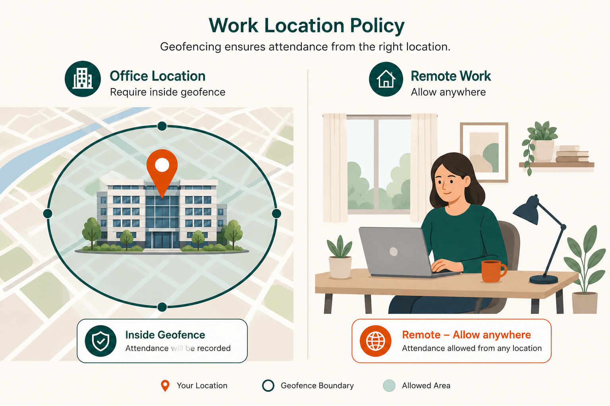
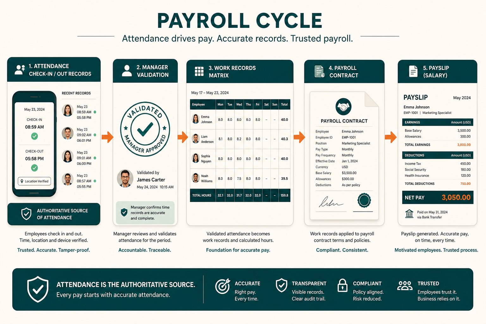
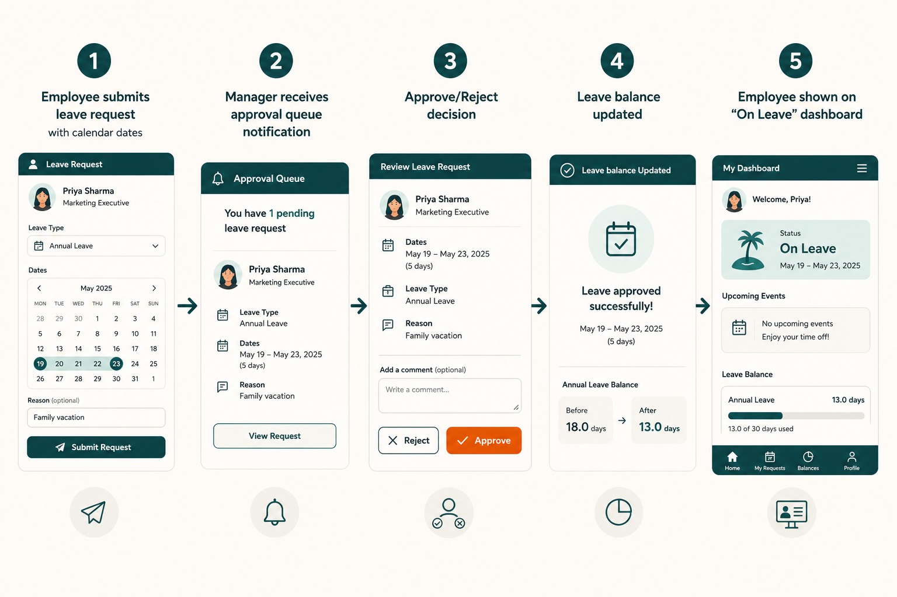
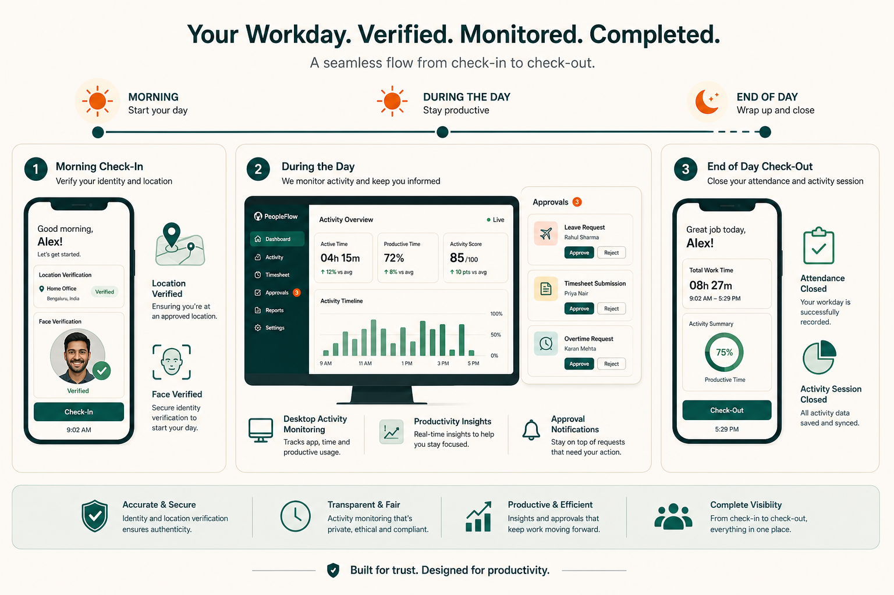
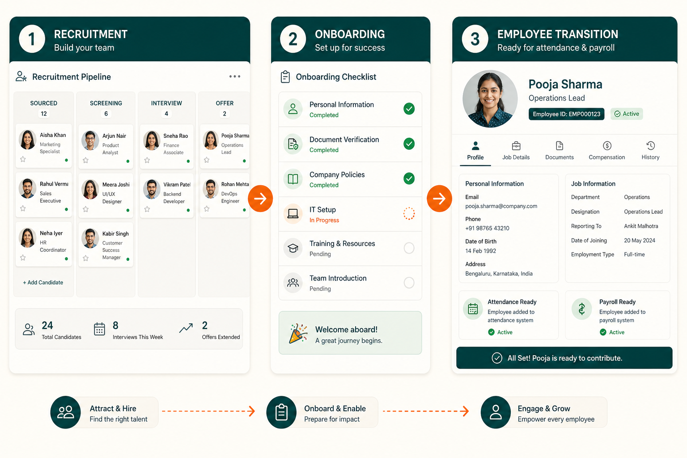

# حالات الاستخدام

سيناريوهات واقعية توضّح كيف يؤدّي أشخاص مختلفون مهامهم في Social HR. مكتوبة كسرد — وليس تعليمات تقنية خطوة بخطوة.

تتوافق الشخصيات مع [الأدوار والصلاحيات](./ROLES_AND_PERMISSIONS.md) داخل المنتج، وليست منتجات أو باقات منفصلة.

> **نظرة سريعة — الشخصيات**
>
> | الشخصية | مكان العمل | ابدأ من |
> |---------|------------|---------|
> | [مشغّل المنصة](#platform-operator-scenarios) | [لوحة التحكم](./PLATFORM.md) | تهيئة تجربة |
> | [مسؤول HR للمؤسسة](#tenant-hr-admin-scenarios) | مساحة عمل المؤسسة | إعداد Geofencing |
> | [المدير](#manager-scenarios) | مساحة عمل المؤسسة | الموافقة على Leave |
> | [الموظف](#employee-scenarios) | مساحة عمل المؤسسة + تطبيق سطح المكتب | تسجيل الحضور |
> | [مسؤول التوظيف](#recruiter-scenarios) | مساحة عمل المؤسسة | مسار التعيين |
> | [أخصائي الرواتب](#payroll-specialist-scenarios) | مساحة عمل المؤسسة | تشغيل قسائم الراتب الشهرية |

---

## الشخصيات {#personas}

| الشخصية | مكان العمل | الأهداف الرئيسية |
|---------|------------|------------------|
| **[مشغّل المنصة](./ROLES_AND_PERMISSIONS.md#platform-operator)** | [لوحة التحكم](./PLATFORM.md) | [تهيئة](./PLATFORM.md) مساحات العمل، تعيين [Plans](./PLANS.md)، إدارة حالة الحساب |
| **[مسؤول HR للمؤسسة](./ROLES_AND_PERMISSIONS.md#tenant-admin)** | تطبيق الموارد البشرية للمؤسسة | إعداد المؤسسة والسياسات والصلاحيات |
| **[المدير](./ROLES_AND_PERMISSIONS.md#manager)** | تطبيق الموارد البشرية للمؤسسة | الموافقة على الطلبات، التحقق من Attendance، مراجعة Activity |
| **[الموظف](./ROLES_AND_PERMISSIONS.md#employee)** | تطبيق الموارد البشرية للمؤسسة (+ تطبيق سطح المكتب اختيارياً) | تسجيل الحضور، طلب Leave، عرض قسائم الراتب |
| **[مسؤول التوظيف](./ROLES_AND_PERMISSIONS.md#recruiter)** | تطبيق الموارد البشرية للمؤسسة | إدارة مسار التوظيف |
| **[أخصائي الرواتب](./ROLES_AND_PERMISSIONS.md#payroll-specialist)** | تطبيق الموارد البشرية للمؤسسة | العقود، قسائم الراتب، الاسترداد/الصرف |

---

## سيناريوهات مشغّل المنصة {#platform-operator-scenarios}

### تهيئة تجربة عميل جديد {#provision-a-new-customer-trial}

أغلق مندوب المبيعات صفقة مع Acme Corp لتقييم لمدة 30 يوماً. يسجّل مشغّل المنصة الدخول إلى [لوحة التحكم](./PLATFORM.md)، يفتح **Tenants → Create**، يدخل «Acme Corp» مع [النطاق الفرعي](./PLATFORM.md) `acme`، ويختار **[باقة Trial](./PLANS.md#trial)**.

خلال لحظات، تكون مساحة Acme المعزولة جاهزة على `acme.socialhr.com` مع تفعيل [Employees](./MODULES.md#employees) و [Attendance](./MODULES.md#attendance) و [Leave](./MODULES.md#leave) و [Face Check-In](./MODULES.md#face-check-in). يشارك المشغّل الرابط وبيانات الدخول الأولية لمدير HR في Acme.

**النتيجة:** لدى Acme مساحة HR معزولة بالوحدات الأساسية — دون أي إعداد تقني من العميل.

ذات صلة: [Overview — Multi-tenant SaaS](./OVERVIEW.md#multi-tenant-saas-in-plain-terms)، [Platform — Control plane](./PLATFORM.md#control-plane).

### ترقية عميل إلى Standard {#upgrade-a-customer-to-standard}

بعد نجاح تجربة Acme، يوقّعون عقد باقة Standard. يفتح مشغّل المنصة سجل مستأجر Acme، يغيّر الباقة من Trial إلى Standard، ويحفظ.

في تسجيل الدخول التالي، يرى فريق HR في Acme ظهور [Recruitment](./MODULES.md#recruitment) و [Payroll](./MODULES.md#payroll) و [Activity Tracking](./MODULES.md#activity-tracking) و [Projects](./MODULES.md#projects) ووحدات Standard الأخرى في الشريط الجانبي. لم تكن هناك عملية ترحيل بيانات أو إعادة تهيئة.

**النتيجة:** توسّع فوري في الميزات. يمكن لمسؤول HR في Acme الآن إعداد عقود Payroll وسياسات Activity.

ذات صلة: [Plans — Upgrading](./PLANS.md#upgrading-and-downgrading).

### إيقاف حساب متأخر السداد {#suspend-a-non-paying-account}

تفوّت Beta Ltd الدفع. يضبط مشغّل المنصة حالة Beta على **Suspended**. في المحاولة التالية لأي مستخدم من Beta لاستخدام Social HR، يُسجَّل خروجه ويرى رسالة تفيد بأن الحساب موقوف.

تبقى بيانات Beta سليمة. عند استلام الدفع، يعيد المشغّل الحالة إلى **Active** ويمكن للمستخدمين تسجيل الدخول كالمعتاد.

**النتيجة:** حظر الوصول فوراً؛ البيانات محفوظة لإعادة التفعيل.

السياسة: [Account access — Suspended](./POLICIES.md#account-access-and-entitlements).

### تفعيل Geofencing لتجربة Enterprise {#enable-geofencing-for-an-enterprise-pilot}

Gamma Inc على [Enterprise](./PLANS.md#enterprise) ويريد [Geofencing](./MODULES.md#geofencing) فوراً، لكن باقته تتضمنه أصلاً. يؤكد المشغّل تعيين الباقة ويُبلّغ مسؤول HR في Gamma بإعداد إحداثيات المكتب ضمن Settings → Geo & Face Config.

لو كانت Gamma على Standard، يمكن للمشغّل إضافة [module override](./PLANS.md#per-customer-module-overrides) لفرض Geofencing قبل ترقية الباقة.

**النتيجة:** الوحدة متاحة؛ يُعدّ العميل قواعد الموقع بنفسه.

---

## سيناريوهات مسؤول HR للمؤسسة {#tenant-hr-admin-scenarios}

### إعداد Geofencing للمكتب {#configure-office-geofencing}

معظم موظفي Acme Corp في المكتب، ويريدون ضمان تسجيل الحضور من المكتب. يقوم مسؤول HR بـ:

1. التأكد من توفر [Geofencing](./MODULES.md#geofencing) ([باقة Enterprise](./PLANS.md#enterprise))
2. فتح Settings → Geo & Face Config، ضبط إحداثيات المكتب ونصف قطر 200 متر، وتفعيل [السياج الجغرافي](./FEATURES.md#geofencing-and-work-type-location-policies)
3. مراجعة [أنواع العمل](./FEATURES.md#geofencing-and-work-type-location-policies): Office يتطلب التواجد داخل السياج؛ Remote يسمح من أي مكان
4. تعيين نوع عمل Office لمعظم الموظفين في معلومات عملهم

**النتيجة:** يجب على موظفي المكتب التواجد داخل دائرة السياج لتسجيل الحضور. يمكن لموظفي Remote التسجيل من أي مكان. يُسجَّل كل فحص موقع.

الميزة: [Geofencing](./FEATURES.md#geofencing-and-work-type-location-policies). المسار: [Work type resolution](./HOW_IT_WORKS.md#work-type-resolution).

### تفعيل تتبع Activity على سطح المكتب {#enable-desktop-activity-monitoring}

يريد Acme رؤية أنماط العمل عن بُعد. يقوم مسؤول HR بـ:

1. التأكد من توفر [Activity Tracking](./MODULES.md#activity-tracking) ([باقة Standard](./PLANS.md#standard))
2. فتح Settings → Attendance → Activity Tracking
3. ضبط عتبة الخمول على 5 دقائق وعتبة المراجعة على 15 دقيقة
4. تفعيل لقطات الشاشة الاختيارية كل 5 دقائق
5. مشاركة رابط تثبيت تطبيق سطح المكتب مع الموظفين
6. توضيح السياسة: تتبع Activity للإشراف؛ [Attendance ما زال يحدد الراتب](./DESIGN_DECISIONS.md#attendance-drives-pay-activity-provides-oversight)

**النتيجة:** يثبّت الموظفون تطبيق سطح المكتب. يستخدم المديرون **نشاط الفريق** لمراجعة مقاطع الخمول وتصنيفها.

الميزة: [Activity tracking](./FEATURES.md#activity-tracking-desktop-monitoring).

### تفعيل Face Check-In {#enable-face-check-in}

يريد Acme تقليل تسجيل الحضور نيابة عن زميل في المكتب. يقوم مسؤول HR بـ:

1. التأكد من توفر [Face Check-In](./MODULES.md#face-check-in) (مضمّن في جميع الباقات)
2. تفعيل Face Check-In في الإعدادات
3. تفعيل الإلزام اختيارياً بحيث يتطلب كل Check-In تحققاً
4. إبلاغ الموظفين: أكمل **Face Registration** في ملفك قبل Check-In التالي

**النتيجة:** يسجّل الموظفون وجوههم مرة واحدة. تتحقق Check-In اللاحقة من الهوية عبر كاميرا الويب قبل تسجيل Attendance.

الميزة: [Face check-in](./FEATURES.md#face-check-in).

### إعداد أنماط العمل الهجين {#set-up-hybrid-work-patterns}

يسمح Acme بالعمل من المنزل أيام الجمعة. يقوم مسؤول HR بـ:

1. إنشاء أو تأكيد نوع عمل Remote بسياسة «السماح من أي مكان»
2. ضبط نوع العمل الافتراضي للموظف على Hybrid (يتطلب السياج الإثنين–الخميس)
3. إضافة تخصيص يوم الأسبوع: الجمعة → Remote للموظفين المعنيين

**النتيجة:** من الإثنين إلى الخميس يجب التواجد في المكتب لتسجيل الحضور. يوم الجمعة يمكن التسجيل من المنزل دون طلب يومي.

المسار: [How It Works — Work type resolution](./HOW_IT_WORKS.md#work-type-resolution).

---

## سيناريوهات المدير {#manager-scenarios}

### الموافقة على العمل عن بُعد ليوم واحد {#approve-remote-work-for-one-day}

تعمل Sarah عادة من المكتب لكنها تحتاج العمل من المنزل يوم الثلاثاء القادم لإصلاح منزلي. تقدّم **[طلب نوع عمل](./FEATURES.md#geofencing-and-work-type-location-policies)** لـ Remote في ذلك التاريخ.

يرى مديرها الطلب في طابور لوحة المعلومات **طلبات نوع عمل بانتظار الموافقة**، يراجعه، ويوافق. يوم الثلاثاء، [نوع العمل الفعلي](./FEATURES.md#geofencing-and-work-type-location-policies) لـ Sarah هو Remote — يمكنها تسجيل الحضور من أي مكان.

**النتيجة:** تجاوز سياسة مؤقت دون تغيير نوع عمل Sarah الدائم.

### التحقق من Attendance قبل Payroll {#validate-attendance-before-payroll}

يُشغَّل Payroll في اليوم 25. يفتح المدير طابور لوحة المعلومات **حضور بانتظار التحقق**، يراجع السجلات المعلّمة خلال الشهر — تأخر، Check-Out ناقص، طلبات تصحيح — ويوافق أو يعيد كل سجل.

بعدها يشغّل أخصائي الرواتب إنشاء قسائم الراتب وهو يعلم أن Attendance رُاجع.

**النتيجة:** اعتماد المدير على سجلات الوقت قبل حساب التعويض.

المسار: [Leave → attendance → payroll](./HOW_IT_WORKS.md#leave--attendance--payroll-chain).

### تصنيف مقطع خمول Activity طويل {#classify-a-long-idle-activity-segment}

كان Ahmed مسجّل حضوراً لكن تطبيق سطح المكتب يظهر 45 دقيقة خمولاً معلّمة «يتطلب مراجعة». يفتح مديره **نشاط الفريق**، يجد المقطع، ويتبيّن أن Ahmed كان في مكالمة عميل لم تُلتقط بنشاط لوحة المفاتيح.

يصنّف المدير المقطع **اجتماع** (مدفوع). ساعات Attendance لـ Ahmed **لا تتغيّر** — التصنيف لتقارير Activity وليس تعديل Payroll.

**النتيجة:** حكم المدير على وقت الخمول غير الواضح دون تغيير تلقائي في الراتب.

السياسة: [Activity tracking — Idle pay](./POLICIES.md#activity-tracking).

---

## سيناريوهات الموظف {#employee-scenarios}

### تسجيل الحضور من المكتب {#clock-in-from-the-office}

تصل Fatima إلى مكتب Acme. تفتح Social HR على هاتفها، تسمح بالوصول للموقع، وتنقر **Check-In**. يؤكد النظام تواجدها داخل السياج الجغرافي للمكتب ويسجّل Attendance.

لو كانت خارج السياج، لرأت رسالة خطأ مع المسافة ويمكنها تقديم طلب نوع عمل للعمل عن بُعد بدلاً من ذلك.

المسار اليومي: [How It Works — Morning](./HOW_IT_WORKS.md#morning-starting-work).

### تسجيل الحضور مع Face Check-In {#clock-in-with-face-verification}

أكمل Omar [تسجيل التعرف على الوجه](./FEATURES.md#geofencing-and-work-type-location-policies) الأسبوع الماضي. عند Check-In، تُفعَّل كاميرته، تُلتقط صورته، ويطابق النظام القوالب المسجّلة. تم التطابق — سُجّل Attendance.

إذا فشل التحقق، يمكن لـ Omar إعادة المحاولة أو تقديم طلب إعادة تسجيل لمراجعة HR.

### طلب Leave ومتابعة الرصيد {#request-leave-and-track-balance}

تحتاج Layla ثلاثة أيام إجازة الشهر القادم. تنقر زر [الإجراءات السريعة](./FEATURES.md#quick-actions) → **Create Leave Request**، تختار «Annual Leave»، تحدّد التواريخ، وتقدّم.

يوافق مديرها من لوحة المعلومات. ينقص رصيد Layla ثلاثة أيام. في تلك التواريخ تظهر في قائمة «في إجازة» ولا تحتاج Check-In.

الميزة: [Leave management](./FEATURES.md#leave-management).

### استخدام تطبيق سطح المكتب أثناء العمل {#use-the-desktop-app-while-working}

يثبّت Khalid Social HR Desktop، يسجّل الدخول، ويسجّل الحضور. يعمل التطبيق في الخلفية ويرسل نبضات Activity. يمكنه عرض **نشاطي** لرؤية خطه الزمني اليومي و[درجة الإنتاجية](./FEATURES.md#geofencing-and-work-type-location-policies).

في نهاية اليوم يسجّل الانصراف — تُغلق جلستا Attendance و Activity.

### تسجيل وقت المشروع {#log-project-time}

عملت Nour أربع ساعات على مشروع إعادة تصميم الموقع. تفتح **Project → Timesheet**، تختار المشروع والمهمة، تدخل أربع ساعات، وتعلّمها مكتملة.

هذه الساعات لتتبع المشروع فقط — Check-In/Check-Out السابق يحدد راتبها.

المبرر: [Design Decisions — Project time separate](./DESIGN_DECISIONS.md#project-time-separate-from-attendance-time).

---

## سيناريوهات مسؤول التوظيف {#recruiter-scenarios}

### التوظيف عبر المسار {#hire-through-the-pipeline}

يفتح فريق HR [Recruitment drive](./MODULES.md#recruitment) لوظيفة «Software Engineer» بمراحل: Applied، Phone Screen، Technical Interview، Offer، Hired.

ينتقل المرشحون عبر مسار Kanban. تُجدول المقابلات وتُسجَّل النتائج. عند وصول مرشح إلى «Hired»، ينتقل إلى لوحة [Onboarding](./MODULES.md#onboarding).

بعد اكتمال مهام Onboarding، يوجد سجل موظف كامل — جاهز لإعداد Attendance و Leave و Payroll.

**النتيجة:** مسار متصل من المتقدّم إلى الموظف دون إدخال بيانات مكرّر.

المسار: [How It Works — Recruitment → onboarding](./HOW_IT_WORKS.md#recruitment--onboarding--employee).

---

## سيناريوهات أخصائي الرواتب {#payroll-specialist-scenarios}

### تشغيل قسائم الراتب الشهرية {#monthly-payslip-run}

اليوم 25. يتأكد أخصائي الرواتب من:

- [Attendance](./MODULES.md#attendance) للفترة مُحقَّق من المديرين
- عقود التوظيف نشطة
- لا تعديلات Leave معلّقة

يفتح لوحة [Payroll](./MODULES.md#payroll) ويُنشئ قسائم الراتب. يطبّق النظام عقد كل موظف والبدلات والخصومات وWork Records المُحقَّقة وتعديلات Leave.

يعرض الموظفون قسائمهم في تبويب Payroll في ملفهم.

**النتيجة:** التعويض محسوب من Attendance المُحقَّق والعقود المُعدّة.

الميزة: [Payroll](./FEATURES.md#payroll).

---

## سيناريو متعدد الأدوار: موظف هجين {#cross-persona-scenario-hybrid-employee}

**الإعداد (مسؤول HR):**

- نوع العمل الافتراضي: Hybrid (يتطلب السياج الجغرافي)
- تخصيص يوم الأسبوع: الجمعة → Remote
- للتنفيذي: علم [تجاوز السياج الجغرافي](./FEATURES.md#geofencing-and-work-type-location-policies) للسفر الدولي

**الإثنين (الموظف):**

- يجب التواجد داخل السياج الجغرافي للمكتب لتسجيل الحضور
- تطبيق سطح المكتب يتتبع Activity خلال اليوم

**الجمعة (الموظف):**

- [نوع العمل الفعلي](./FEATURES.md#geofencing-and-work-type-location-policies) هو Remote — Check-In من المنزل
- لا يُطبَّق فحص السياج الجغرافي

**الخميس (تنفيذي مسافر):**

- علم تجاوز السياج الجغرافي يسمح بـ Check-In بغض النظر عن الموقع
- سجل التدقيق يوثّق التجاوز

**نهاية الشهر (المدير + Payroll):**

- يتحقق المدير من كل Attendance
- يُنشئ أخصائي الرواتب قسائم الراتب من السجلات المُحقَّقة

مرجع بصري: [Work type resolution](../../product/assets/work-type-resolution.png). السياسة: [Geofencing policies](./POLICIES.md#geofencing-and-location).

---

## مستندات ذات صلة

- [Roles & Permissions](./ROLES_AND_PERMISSIONS.md) — من يفعل ماذا
- [Features](./FEATURES.md) — تفاصيل القدرات وراء هذه السيناريوهات
- [Policies](./POLICIES.md) — القواعد التي تحكم السلوك
- [How It Works](./HOW_IT_WORKS.md) — ترابط الوحدات
- [Modules](./MODULES.md) — دليل الوحدات
- [Plans](./PLANS.md) — الباقات المذكورة في السيناريوهات
