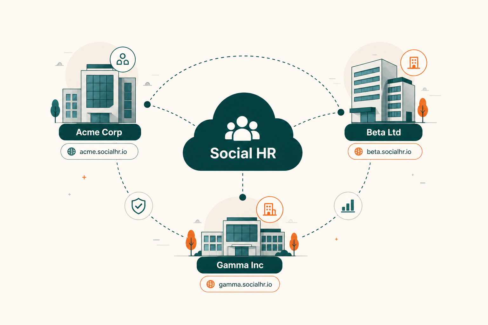

{ width="120" .shr-home-logo }

# Social HR

**Modern HR for growing organizations** — recruitment, attendance, leave, payroll, and workforce visibility in one secure workspace per company.

[Get started — Overview](product/OVERVIEW.md){ .md-button .md-button--primary }
[Explore features](product/FEATURES.md){ .md-button }

---

## What you'll find here

Product documentation for **HR leaders, buyers, implementation consultants, and onboarding teams**. Plain language — no code, no infrastructure detail.

| Start here | Best for |
|------------|----------|
| [Overview](product/OVERVIEW.md) | What Social HR is and who it serves |
| [Features](product/FEATURES.md) | Attendance, geofencing, face check-in, activity monitoring |
| [Modules](product/MODULES.md) | All HR modules explained as product capabilities |
| [Plans](product/PLANS.md) | Trial, Standard, and Enterprise tiers |
| [How it works](product/HOW_IT_WORKS.md) | Hire-to-retire flows and module connections |
| [Use cases](product/USE_CASES.md) | Real scenarios by persona |
| [Policies](product/POLICIES.md) | Rules your organization experiences in the product |

---

## Highlights

- **One workspace per organization** — isolated HR environment on its own subdomain
- **Attendance drives pay** — check-in/out is the authoritative source for payroll hours
- **Plan-based modules** — enable recruitment, payroll, geofencing, face check-in, and more per tier
- **Arabic-first** — default Arabic UI with English and other locales via the language switcher
- **Workforce visibility** — optional geofencing, face verification, and desktop activity monitoring

---

## Browse by role

| Role | Recommended path |
|------|------------------|
| **Evaluator / buyer** | [Overview](product/OVERVIEW.md) → [Features](product/FEATURES.md) → [Plans](product/PLANS.md) |
| **HR director** | [Modules](product/MODULES.md) → [Policies](product/POLICIES.md) → [Use cases](product/USE_CASES.md) |
| **Implementation** | [How it works](product/HOW_IT_WORKS.md) → [Roles & permissions](product/ROLES_AND_PERMISSIONS.md) → [Platform](product/PLATFORM.md) |

---

## Full documentation index

See the [product documentation index](product/README.md) for the complete table of contents.
