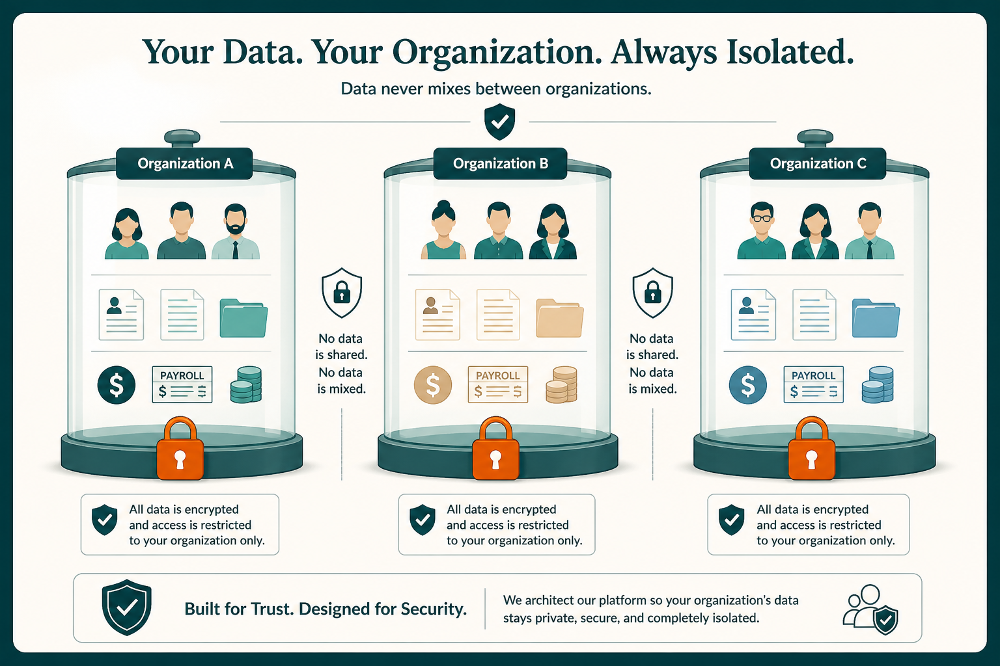
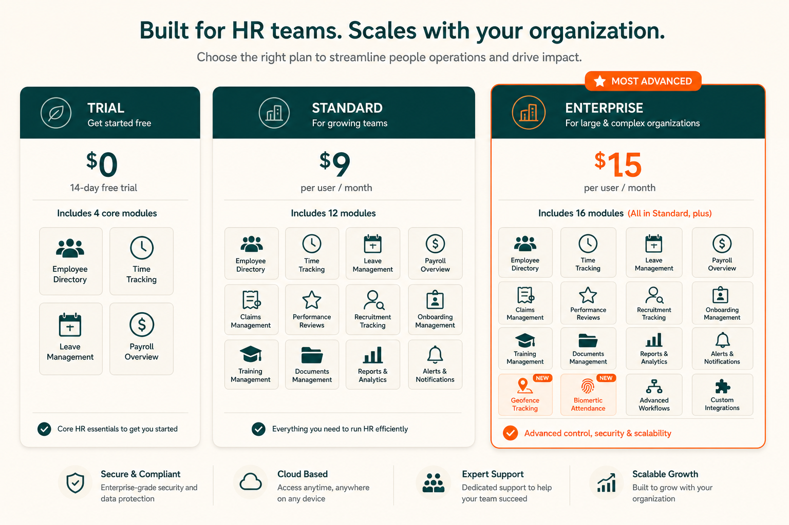
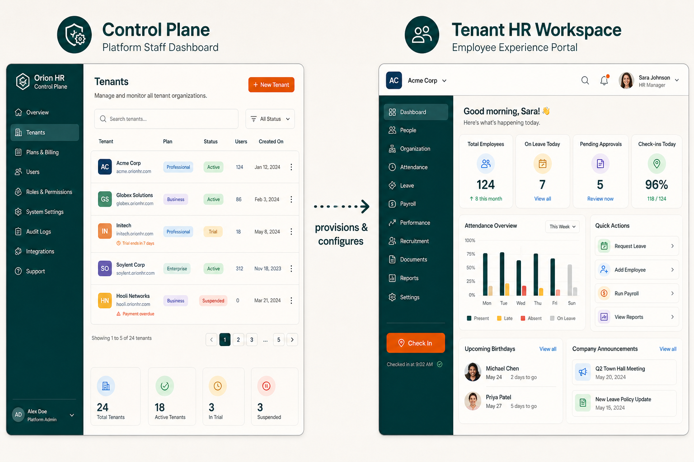
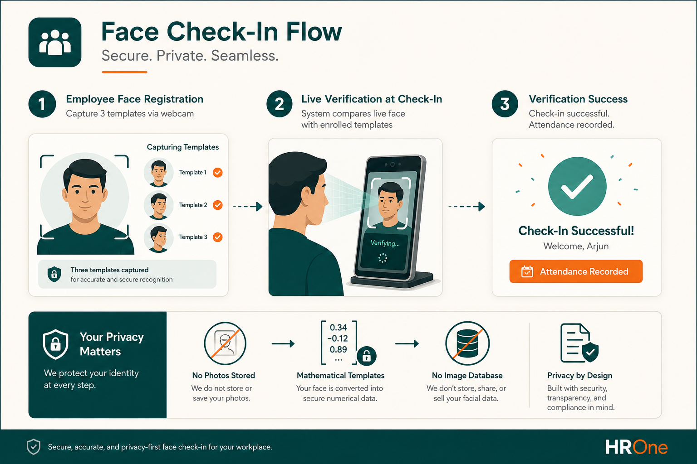

# Design Decisions

Why Social HR was built the way it is — explained for product owners, HR leaders, and business stakeholders.

Each decision follows a simple structure: **context** (the problem), **decision** (what was chosen), and **why it matters** (impact on users and the business).

> **At a glance**
>
> | Decision | User impact |
> |----------|-------------|
> | [Isolated workspace per customer](#isolated-workspace-per-customer) | "Your data is completely separate" |
> | [No company switcher](#no-company-switcher) | One org = one workspace |
> | [Attendance drives pay](#attendance-drives-pay-activity-provides-oversight) | Clear pay source; activity is oversight |
> | [Work-type location policies](#work-type-location-policies-not-a-single-remote-flag) | Flexible hybrid rules |
> | [Arabic as default](#arabic-as-the-default-language) | Native first-run for GCC users |

Policies resulting from these decisions: [Policies](./POLICIES.md).

---

## Isolated workspace per customer

**Context:** Traditional HR software often puts multiple companies in one shared database, relying on filters to keep data separate. Social HR sells dedicated workspaces accessed via unique web addresses.

**Decision:** Each customer organization gets a fully isolated [workspace](./PLATFORM.md). One customer, one web address, one self-contained environment.

**Why it matters for users and business:**

- Customers can trust that their HR data — salaries, disciplinary records, medical leave — never mixes with another organization.
- Sales can honestly say "your data is completely separate" without caveats about shared infrastructure.
- Compliance conversations are simpler: isolation is architectural, not just a permission setting.
- **Trade-off:** each workspace is one organization. Customers needing multi-entity management within one login would need separate workspaces.

Policy: [Data isolation](./POLICIES.md#data-isolation-and-privacy). Overview: [Multi-tenant SaaS](./OVERVIEW.md#multi-tenant-saas-in-plain-terms).

---

## No company switcher

**Context:** The original Horilla HR platform supported multiple companies within one installation, with a switcher to move between them.

**Decision:** Remove the company concept entirely. The customer workspace **is** the company.

**Why it matters:**

- Eliminates confusion between "[tenant](./PLATFORM.md)" and "company" — one clear boundary.
- Simplifies permissions, reporting, and file storage.
- Aligns with the SaaS model: each customer is one organization on one [subdomain](./PLATFORM.md).
- **Trade-off:** organizations with multiple legal entities under one HR department would use separate workspaces or manage entities through departments.

See [Removed concepts — Company](./DESIGN_DECISIONS.md#no-company-switcher).

---

## Attendance drives pay; activity provides oversight

**Context:** Desktop monitoring products often blur "hours at computer" with "hours worked," creating payroll and legal ambiguity.

**Decision:** [Attendance](./MODULES.md#attendance) (check-in/out, validated work records) is the authoritative source for pay hours. [Activity monitoring](./FEATURES.md#activity-tracking-desktop-monitoring) tracks desktop presence but does not automatically change payroll.

**Why it matters:**

- Payroll specialists and legal teams have a clear, auditable pay source.
- Activity adds manager visibility without replacing time clocks.
- Managers actively classify ambiguous idle time (Paid / Unpaid / Meeting) rather than the system making pay decisions automatically.
- [Productivity scores](./FEATURES.md#geofencing-and-work-type-location-policies) are informational — they never appear on payslips.
- **Trade-off:** organizations wanting automatic pay deduction for idle time must handle that outside Social HR or through manual attendance adjustment.

Policy: [Activity tracking — Idle pay](./POLICIES.md#activity-tracking). Flow: [How It Works — Attendance sources](./HOW_IT_WORKS.md#attendance-sources-and-pay-authority).

---

## Work-type location policies, not a single remote flag

**Context:** Modern workforces need office, remote, hybrid, and field patterns — with temporary overrides for specific days.

**Decision:** Location rules are tied to **[work types](./FEATURES.md#geofencing-and-work-type-location-policies)** with three policy options (require geofence, allow anywhere, block clock-in), resolved per day through a priority chain.

**Why it matters:**

- HR configures once per work type; employees experience consistent rules.
- Temporary remote days work via approved [work type requests](./FEATURES.md#geofencing-and-work-type-location-policies) — no permanent profile changes.
- Weekday overrides support patterns like "Friday remote" without daily requests.
- Per-employee [bypass geofence](./FEATURES.md#geofencing-and-work-type-location-policies) handles executive travel and exceptions.
- **Trade-off:** HR must understand work type configuration. Misconfigured work types can block legitimate check-ins.

Feature: [Geofencing](./FEATURES.md#geofencing-and-work-type-location-policies). Scenario: [Hybrid employee](./USE_CASES.md#cross-persona-scenario-hybrid-employee).

---

## Plans and modules managed centrally

**Context:** SaaS products need sellable tiers and the ability to turn features on/off per customer without rebuilding their workspace.

**Decision:** [Subscription plans](./PLANS.md) and [module](./PLATFORM.md) assignments are managed in the [control plane](./PLATFORM.md), not inside each customer workspace. Changes take effect immediately.

**Why it matters:**

- Sales can upgrade a customer instantly — new modules appear without technical intervention.
- [Platform operators](./ROLES_AND_PERMISSIONS.md#platform-operator) can pilot features on specific customers via [overrides](./PLANS.md#per-customer-module-overrides).
- Customers never see modules they haven't purchased.
- Disabled modules are both hidden and blocked for security.
- **Trade-off:** plan limits like maximum employees are stored but not yet enforced in the product.

---

## Separate platform and customer experiences

**Context:** Platform operators (Social HR staff) and customer users (HR, employees) have fundamentally different jobs.

**Decision:** Two separate interfaces — [control plane](./PLATFORM.md) for platform staff, HR workspace for customer users — on different web addresses with separate login.

**Why it matters:**

- Customer HR admins never accidentally see platform provisioning screens.
- Platform staff operations don't clutter the customer HR experience.
- Security boundary: platform access requires separate staff credentials.
- **Trade-off:** platform staff need a separate login to support customer workspaces.

Platform: [Two surfaces](./PLATFORM.md#two-surfaces-one-product).

---

## Face verification as an optional gate

**Context:** Organizations want to reduce proxy clock-in but have varying comfort with biometric data.

**Decision:** [Face check-in](./FEATURES.md#face-check-in) is optional, stores mathematical templates (not photos), and gates the clock-in action without replacing attendance records.

**Why it matters:**

- Available on all [plans](./PLANS.md) including Trial — easy to evaluate.
- Privacy-conscious design: enrollment photos are not retained.
- HR chooses whether to enable, enforce, or leave optional.
- Failed verification has a human path: re-enrollment requests.
- **Trade-off:** requires webcam, adequate lighting, and face processing infrastructure managed by platform operators.

Policy: [Face check-in policies](./POLICIES.md#face-check-in).

---

## Arabic as the default language

**Context:** Primary market users expect Arabic HR terminology and a first-run experience in their language.

**Decision:** Arabic is the default interface language, with standardized HR terminology across the product.

**Why it matters:**

- First login feels native to Saudi/GCC HR teams.
- Terminology is standardized (e.g., check-in → تسجيل الحضور) across the product.
- English and other locales remain available via language switcher.
- Training materials can reference product documentation for consistency.
- **Trade-off:** demo content and documentation should account for right-to-left layout where applicable.

Feature: [Internationalization](./FEATURES.md#internationalization-arabic-first).

---

## Project time separate from attendance time

**Context:** Organizations track project delivery hours separately from payroll hours — conflating them creates reporting and pay disputes.

**Decision:** [Project timesheets](./MODULES.md#projects) log hours on tasks for delivery tracking. [Attendance](./MODULES.md#attendance) check-in/out drives pay. No automatic link between them.

**Why it matters:**

- Project managers see task progress without affecting payroll.
- Payroll specialists work from validated attendance, not project logs.
- Clear separation prevents "I logged 8 hours on the project but only checked in for 6" disputes.
- **Trade-off:** employees log time in two places when both project tracking and attendance are required.

Policy: [Project timesheets](./POLICIES.md#project-timesheets). Flow: [Projects vs attendance](./HOW_IT_WORKS.md#projects-vs-attendance).

---

## Background work runs per customer

**Context:** Scheduled tasks (payslip generation, leave balance resets, shift rotations) must run independently for each customer workspace without one customer's job affecting another.

**Decision:** All scheduled background work runs separately for each customer workspace, orchestrated from a single platform scheduler.

**Why it matters:**

- Customer A's payslip run never delays or interferes with Customer B's.
- Platform scales by adding processing capacity, not by duplicating schedulers.
- **Trade-off:** processing all customers sequentially adds slight delay compared to per-customer dedicated schedulers — acceptable at B2B HR scale.

---

## Files namespaced per customer

**Context:** Multiple customer workspaces may share underlying storage infrastructure.

**Decision:** Every uploaded file is stored in a path reserved for that customer workspace.

**Why it matters:**

- Prevents accidental file collisions between customers on shared storage.
- Supports cloud storage with a single bucket per deployment.
- Backup and restore preserves customer separation.
- **Trade-off:** none significant for end users.

Policy: [Data isolation — File separation](./POLICIES.md#data-isolation-and-privacy).

---

## Honest limitations as design choices

Some gaps are deliberate deferrals, not oversights:

| Limitation | Rationale |
|------------|-----------|
| No automated billing | Manual status management sufficient for early-stage SaaS; billing integration planned separately |
| No seat enforcement | Allows flexible pilot programs; enforcement added when pricing model requires it |
| No cross-customer analytics | Would violate isolation story; platform metrics live in control plane only |
| Activity idle not auto-deducted | Protects payroll accuracy and legal clarity; manager judgment preferred |

Full list: [Policies — Explicit non-policies](./POLICIES.md#explicit-non-policies-known-gaps), [Overview — Gaps](./OVERVIEW.md#what-social-hr-does-not-do-today).

---

## Related documents

- [Policies](./POLICIES.md) — rules resulting from these decisions
- [Features](./FEATURES.md) — capabilities shaped by these choices
- [Overview](./OVERVIEW.md) — product summary
- [Platform](./PLATFORM.md) — control plane vs workspace split
- [How It Works](./HOW_IT_WORKS.md) — flows shaped by these decisions
