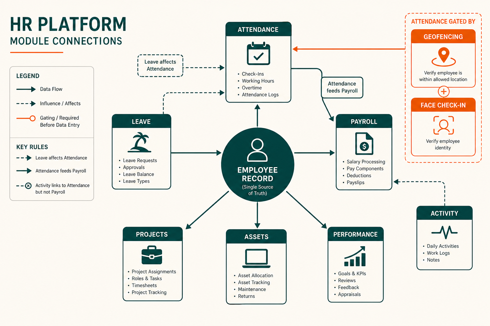
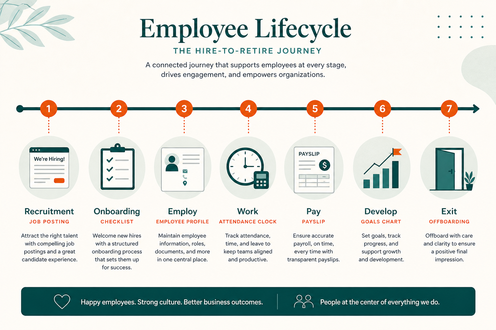

# How It Works

Conceptual explanation of how Social HR [modules](./MODULES.md) connect and how work flows through the system — from hiring to offboarding, and from clock-in to payslip.

No technical implementation details. Focus is on **what happens**, **in what order**, and **who is involved**.

> **At a glance**
>
> | Flow | Key insight |
> |------|-------------|
> | **Employee record** | Hub for almost all modules |
> | **Daily workday** | Check-in → policies → work → check-out |
> | **Pay chain** | Attendance → validation → work records → payroll |
> | **Activity** | Links to attendance session; does **not** change pay |

---

## The employee record as hub

Almost everything in Social HR connects to the **employee record**. When someone joins the organization, an employee profile is created (directly or via [recruitment](./MODULES.md#recruitment) → [onboarding](./MODULES.md#onboarding)). That record becomes the anchor for:

- Work schedule (shift, [work type](./FEATURES.md#geofencing-and-work-type-location-policies))
- [Attendance](./MODULES.md#attendance) and [leave](./MODULES.md#leave)
- [Payroll](./MODULES.md#payroll) contract
- [Performance](./MODULES.md#performance-pms) goals
- Assigned [assets](./MODULES.md#assets)
- [Project](./MODULES.md#projects) membership
- [Helpdesk](./MODULES.md#helpdesk) tickets
- [Offboarding](./MODULES.md#offboarding) process

*Employee record at the center. Leave affects attendance; validated attendance feeds payroll. Geofencing and face check-in gate attendance; activity links but does not drive pay.*

---

## Hire to retire lifecycle

### Stage by stage

| Stage | [Module](./MODULES.md) | What happens |
|-------|--------|--------------|
| **Attract** | [Recruitment](./MODULES.md#recruitment) | Job posted, candidates apply, pipeline stages |
| **Select** | Recruitment | Interviews, assessments, hiring decision |
| **Onboard** | [Onboarding](./MODULES.md#onboarding) | Task boards for HR, IT, and new hire |
| **Employ** | [Employees](./MODULES.md#employees) | Profile active; org structure assigned |
| **Schedule** | Employees + Configuration | Shift, work type, rotating assignments |
| **Work** | Attendance + extensions | Daily check-in/out with optional location, face, activity |
| **Time off** | [Leave](./MODULES.md#leave) | Requests, approvals, balance deductions |
| **Pay** | [Payroll](./MODULES.md#payroll) | Contract + validated attendance → payslip |
| **Develop** | [Performance (PMS)](./MODULES.md#performance-pms) | Goals, feedback cycles, bonus points |
| **Support** | Helpdesk, Assets, Projects | Operational needs parallel to core HR |
| **Exit** | [Offboarding](./MODULES.md#offboarding) | Resignation, asset return, deactivation |

Scenario walkthrough: [Use Cases — Hire through the pipeline](./USE_CASES.md#hire-through-the-pipeline).

---

## Daily work flow

### Morning: starting work

1. Employee opens Social HR (web or desktop app)
2. Clicks **Check-In** in the navbar
3. System evaluates policies in order:
   - Is [geofencing](./FEATURES.md#geofencing-and-work-type-location-policies) active? → check location against [work type](./FEATURES.md#geofencing-and-work-type-location-policies) policy
   - Is [face check-in](./FEATURES.md#face-check-in) enabled? → verify identity via webcam
   - Is [activity tracking](./FEATURES.md#activity-tracking-desktop-monitoring) required? → confirm desktop app connected
4. Check-in succeeds → [attendance record](./MODULES.md#attendance) created
5. If desktop app running → activity session begins

### During the day

- Employee works; desktop app sends activity [heartbeats](./FEATURES.md#geofencing-and-work-type-location-policies) (if enabled)
- Idle time classified automatically; long idle flagged for manager review
- Employee may submit [quick actions](./FEATURES.md#quick-actions) (leave, work type change, reimbursement)
- Manager sees approval queues on [dashboard](./FEATURES.md#dashboard)

### End of day

1. Employee clicks **Check-Out**
2. Attendance record completed with end time
3. Activity session closes
4. Employee can view daily activity summary and [productivity score](./FEATURES.md#geofencing-and-work-type-location-policies)

Scenario: [Use Cases — Clock in from the office](./USE_CASES.md#clock-in-from-the-office).

---

## Work type resolution

When [geofencing](./MODULES.md#geofencing) is active, the system must determine **which work type applies today** before checking location.

**Priority order:**

1. **Approved [work type request](./FEATURES.md#geofencing-and-work-type-location-policies)** for today (highest priority)
2. **Weekday override** (e.g., Friday = Remote)
3. **Rotating work type assignment**
4. **Default work type** on employee record

Then the [location policy](./FEATURES.md#geofencing-and-work-type-location-policies) is applied → allow or deny check-in.

**Example — hybrid employee (Mon–Thu office, Fri remote):**

- Default work type: Hybrid (requires geofence)
- Weekday override: Friday → Remote (allow anywhere)
- Thursday: must be inside office geofence
- Friday: can check in from anywhere

**Temporary override:** Employee submits work type request for "Remote on Thursday" → manager approves → Thursday uses Remote policy regardless of weekday default.

Scenario: [Use Cases — Hybrid employee cross-persona](./USE_CASES.md#cross-persona-scenario-hybrid-employee). Policy: [Geofencing policies](./POLICIES.md#geofencing-and-location).

---

## Attendance sources and pay authority

Multiple methods can create or gate attendance, but **attendance records drive payroll**:

| Source | Role | Pay impact |
|--------|------|------------|
| Navbar check-in/out | Creates attendance records | **Primary pay source** |
| [Geofencing](./FEATURES.md#geofencing-and-work-type-location-policies) | Allows or denies check-in | Gates only — no pay calculation |
| [Face check-in](./FEATURES.md#face-check-in) | Verifies identity before check-in | Gates only |
| [Biometric devices](./MODULES.md#biometric-devices) | Hardware punch creates attendance | Creates attendance records |
| [Activity desktop app](./FEATURES.md#activity-tracking-desktop-monitoring) | Monitors presence during session | **No direct payslip impact** |
| Approved [leave](./MODULES.md#leave) | Marks days on leave | Reduces working days in payroll |
| [Work records](./MODULES.md#attendance) | Daily matrix | Feeds payroll calculations |

**Key principle:** [Activity monitoring](./FEATURES.md#activity-tracking-desktop-monitoring) provides oversight. Managers classify ambiguous idle time (Paid / Unpaid / Meeting), but idle time never automatically reduces attendance hours or payslip amounts.

Rationale: [Design Decisions — Attendance drives pay](./DESIGN_DECISIONS.md#attendance-drives-pay-activity-provides-oversight).

---

## Leave → attendance → payroll chain

| Step | Who | What happens |
|------|-----|--------------|
| 1 | Employee | Submits leave request with dates and type |
| 2 | Manager | Approves or rejects from dashboard queue |
| 3 | System | Deducts leave balance; marks employee "on leave" for those dates |
| 4 | Attendance | Leave days appear in work record matrix |
| 5 | Payroll specialist | Runs payslip generation for the period |
| 6 | System | Applies leave adjustments to payslip calculations |
| 7 | Employee | Views payslip on profile (if permitted) |

Leave workflow visual: [Leave workflow illustration](./assets/leave-workflow.png).

[Compensatory leave](./FEATURES.md#leave-management) (when enabled) links overtime from the attendance [hour account](./MODULES.md#attendance) back to leave balances.

---

## Activity monitoring flow

1. Employee installs Social HR Desktop and logs in
2. Employee checks in (web or app)
3. Desktop app sends heartbeats at regular intervals
4. System classifies time as active, idle, or review-required
5. When idle exceeds review threshold → manager sees segment in Team Activity
6. Manager classifies: **Paid**, **Unpaid**, or **Meeting**
7. Employee checks out → activity session closes
8. **Attendance hours unchanged** by activity decisions

Scenario: [Use Cases — Classify idle activity segment](./USE_CASES.md#classify-a-long-idle-activity-segment).

---

## Recruitment → onboarding → employee

| Transition | Trigger | Result |
|------------|---------|--------|
| Candidate in pipeline | Recruiter moves through stages | Interview records, assessments |
| Candidate hired | Hiring stage reached | Candidate moves to onboarding board |
| Onboarding complete | Tasks finished | Employee record created or completed |
| Day-to-day HR | Employee active | Attendance, leave, payroll, etc. begin |

Dashboard shows bridges between modules: "Hired Candidates," "Candidates Started Onboarding."

---

## Projects vs attendance

These are intentionally separate:

| Concept | Module | Purpose |
|---------|--------|---------|
| **Office hours** | [Attendance](./MODULES.md#attendance) | When employee worked — drives pay |
| **Project hours** | [Projects](./MODULES.md#projects) | Time spent on specific tasks — drives project delivery metrics |

An employee checks in for attendance (pay) and separately logs timesheet hours on project tasks (delivery tracking). Project hours do not require manager approval — status reflects progress only.

Rationale: [Design Decisions — Project time separate](./DESIGN_DECISIONS.md#project-time-separate-from-attendance-time). Scenario: [Use Cases — Log project time](./USE_CASES.md#log-project-time).

---

## Plan changes and module visibility

[Plans](./PLANS.md) do not change how modules connect internally. They control **visibility and access**:

- Upgrade plan → new modules appear in sidebar → customer configures them
- Downgrade or disable module → hidden from navigation and blocked
- Data from disabled modules is retained

[Per-customer overrides](./PLANS.md#per-customer-module-overrides) can enable modules outside the plan (pilot) or disable modules within the plan (restriction).

---

## Configuration affecting multiple modules

Organization-wide settings in the Configuration section affect several modules at once:

| Setting | Modules affected |
|---------|------------------|
| Holidays | [Leave](./MODULES.md#leave) calculations, [attendance](./MODULES.md#attendance) |
| Company leaves | Organization-wide non-working patterns |
| Restrict leaves | Blocks leave applications in date ranges |
| Multiple approvals | Multi-step chains for leave and other requests |
| Mail templates | Email notifications across all modules |

HR administrators configure these once; effects propagate to leave, attendance, recruitment emails, and more.

---

## Related documents

- [Modules](./MODULES.md) — individual module descriptions
- [Features](./FEATURES.md) — detailed feature capabilities
- [Use Cases](./USE_CASES.md) — narrative scenarios
- [Policies](./POLICIES.md) — rules governing these flows
- [Plans](./PLANS.md) — module availability by tier
