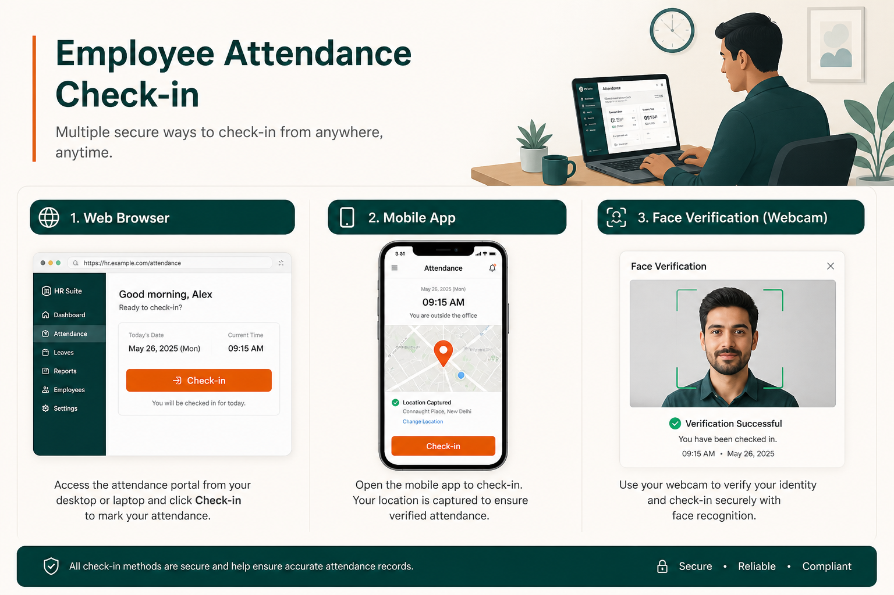

# Modules

Social HR organizes HR capabilities into **[modules](./PLATFORM.md)** — self-contained areas of the product that appear in the sidebar navigation when entitled by the customer's [plan](./PLANS.md).

Each module below is described as a **mini product page**: purpose, capabilities, who uses it, typical workflow, benefits, and limitations.

For [plan availability](./PLANS.md#full-module-catalog), see Plans. For how modules connect, see [How It Works](./HOW_IT_WORKS.md).

> **At a glance**
>
> | Category | Modules |
> |----------|---------|
> | **Lifecycle** | Recruitment → Onboarding → Employees → Offboarding |
> | **Time & pay** | Attendance, Leave, Payroll |
> | **Development** | Performance (PMS) |
> | **Operations** | Assets, Helpdesk, Projects, Documents |
> | **Social HR extensions** | Geofencing, Face Check-In, Activity Tracking, Biometric Devices |

---

## Core HR modules

### Employees

**Purpose:** Central people directory — the **hub** for every employee record in the organization. Almost all other [modules](./HOW_IT_WORKS.md#the-employee-record-as-hub) connect here.

> **At a glance:** Directory · org chart · shifts · work types · document requests

| | |
|---|---|
| **Who uses it** | Everyone — HR maintains records; managers view teams; employees update profiles |
| **Typical workflow** | HR creates employee → assigns department, [work type](./FEATURES.md#geofencing-and-work-type-location-policies), shift → employee self-service begins |
| **Depends on** | Organization settings (departments, work types, shifts) in Configuration |

**Key capabilities:**

- Employee profiles with personal, work, bank, and document information
- Organizational chart and department structure
- Shift and [work type](./FEATURES.md#geofencing-and-work-type-location-policies) assignments, including rotating schedules
- Shift requests and [work type requests](./FEATURES.md#geofencing-and-work-type-location-policies) (temporary schedule changes)
- Disciplinary actions and policy document distribution
- Document requests from HR to employees

**Benefits:** Single source of truth for people data; anchor for attendance, leave, payroll, and performance.

**Limitations:** One workspace = one organization — no company switcher ([Design Decisions](./DESIGN_DECISIONS.md#no-company-switcher)).

**Plan availability:** All plans.

---

### Recruitment

**Purpose:** Manage the hiring pipeline from job opening to hired candidate.

> **At a glance:** Pipeline stages · kanban · interviews · surveys · hire → onboarding

| | |
|---|---|
| **Who uses it** | [Recruiters](./ROLES_AND_PERMISSIONS.md#recruiter), hiring managers, HR administrators |
| **Typical workflow** | Create drive → add candidates → move through stages → hire → [onboarding](./MODULES.md#onboarding) |
| **Connects to** | [Onboarding](./MODULES.md#onboarding), [Employees](./MODULES.md#employees) |

**Key capabilities:**

- Recruitment drives with customizable pipeline stages
- Candidate records and kanban pipeline view
- Interview scheduling and outcome tracking
- Recruitment surveys and skill zone assessments
- Open job postings (with optional external integration)
- Conversion of hired candidates to onboarding

**Benefits:** Structured hiring with dashboard analytics; seamless path to employee record.

**Limitations:** Standard and Enterprise only (not default Trial). External job board integrations depend on configuration.

**Plan availability:** [Standard, Enterprise](./PLANS.md#standard).

---

### Onboarding

**Purpose:** Structured task boards for new hires after they are recruited.

> **At a glance:** Task checklists · HR/IT/new-hire tasks · progress tracking

| | |
|---|---|
| **Who uses it** | HR administrators, new hires, department coordinators |
| **Typical workflow** | Hired candidate arrives → tasks assigned to HR, IT, employee → completion creates employee record |
| **Connects to** | [Recruitment](./MODULES.md#recruitment), [Employees](./MODULES.md#employees) |

**Key capabilities:**

- Onboarding views linked to hired candidates
- Task checklists for HR, IT, and the new employee
- Progress tracking until the employee record is complete

**Benefits:** Nothing falls through the cracks during new-hire setup; dashboard shows onboarding progress.

**Limitations:** Standard and Enterprise only.

**Plan availability:** [Standard, Enterprise](./PLANS.md#standard).

---

### Attendance

**Purpose:** Record when employees work — the **authoritative source for [pay hours](./MODULES.md#attendance)**.

> **At a glance:** Check-in/out · validation · work records · overtime · IP restrictions

| | |
|---|---|
| **Who uses it** | All employees clock in; managers validate; HR configures; payroll relies on records |
| **Typical workflow** | Check-in → policies applied → check-out → manager validates → payroll |
| **Connects to** | [Geofencing](./MODULES.md#geofencing), [Face Check-In](./MODULES.md#face-check-in), [Activity Tracking](./MODULES.md#activity-tracking), [Payroll](./MODULES.md#payroll) |

**Key capabilities:**

- Check-in and check-out from the navbar or attendance screens
- Attendance records, requests (corrections), and manager validation
- [Work records](./MODULES.md#attendance) — daily matrix used by payroll
- [Hour account](./MODULES.md#attendance) for overtime tracking
- Late arrival and early departure tracking
- Optional IP restrictions for clock-in locations
- Integration with geofencing, face check-in, biometric devices, and activity monitoring

**Benefits:** Single pay source; multiple clock-in methods; correction request workflow.

**Limitations:** [Activity idle time](./FEATURES.md#activity-tracking-desktop-monitoring) does not automatically reduce hours. [Project timesheets](./MODULES.md#projects) are separate.

Deep dive: [Features — Attendance](./FEATURES.md#attendance-and-check-in). Policy: [Attendance policies](./POLICIES.md#attendance).

**Plan availability:** All plans.

---

### Leave

**Purpose:** Manage time off — types, balances, requests, and approvals.

> **At a glance:** Leave types · balances · approval workflow · holidays · compensatory leave

| | |
|---|---|
| **Who uses it** | Employees request; managers approve; HR configures types and balances |
| **Typical workflow** | Request → approval → balance deduction → reflected in attendance and payroll |
| **Connects to** | [Attendance](./MODULES.md#attendance), [Payroll](./MODULES.md#payroll) |

**Key capabilities:**

- Leave types (annual, sick, unpaid, etc.) with configurable rules
- Leave balances and allocation requests
- Leave request workflow with manager approval
- Compensatory leave linked to overtime (when enabled)
- Dashboard analytics and "who is on leave today" views
- Integration with holidays and company-wide leave patterns

**Benefits:** Configurable approval chains; dashboard visibility; feeds payroll calculations.

**Limitations:** Restrict leave rules can block applications — HR must configure carefully.

Deep dive: [Features — Leave management](./FEATURES.md#leave-management). Policy: [Leave policies](./POLICIES.md#leave).

**Plan availability:** All plans.

---

### Payroll

**Purpose:** Process employee compensation — contracts, payslips, and related payments.

> **At a glance:** Contracts · payslips · allowances · deductions · reimbursements

| | |
|---|---|
| **Who uses it** | [Payroll specialists](./ROLES_AND_PERMISSIONS.md#payroll-specialist), HR administrators, employees (view own payslips) |
| **Typical workflow** | Contract setup → validated attendance → payslip generation → employee access |
| **Depends on** | Validated [attendance](./MODULES.md#attendance) and [leave](./MODULES.md#leave) records |

**Key capabilities:**

- Employment contracts with salary structures
- Allowances and deductions
- Payslip generation (manual or scheduled)
- Loans, advances, encashments, and reimbursements
- Federal tax configuration

**Benefits:** Integrated with attendance and leave — no duplicate data entry.

**Limitations:** Requires validated attendance; no standard external accounting integration documented.

Deep dive: [Features — Payroll](./FEATURES.md#payroll). Policy: [Payroll policies](./POLICIES.md#payroll).

**Plan availability:** [Standard, Enterprise](./PLANS.md#standard).

---

### Performance (PMS)

**Purpose:** Goals, feedback, and performance management cycles.

> **At a glance:** OKRs · 360 feedback · review periods · bonus points

| | |
|---|---|
| **Who uses it** | Employees set goals; managers review; HR configures cycles |
| **Typical workflow** | HR opens review period → employees set OKRs → feedback collected → manager review |

**Key capabilities:**

- Objectives and key results (OKRs)
- 360-degree feedback cycles with question templates
- Performance meetings and review periods
- Bonus points ledger

**Benefits:** Structured performance culture; dashboard charts for objective status.

**Limitations:** Standard and Enterprise only.

**Plan availability:** [Standard, Enterprise](./PLANS.md#standard).

---

### Offboarding

**Purpose:** Structured employee exit processes.

> **At a glance:** Exit stages · resignation letters · asset return coordination

| | |
|---|---|
| **Who uses it** | HR administrators, departing employees, IT |
| **Typical workflow** | Resignation → exit checklist → asset return → deactivation |

**Key capabilities:**

- Exit process stages and checklists
- Resignation letter management
- Coordination with [asset](./MODULES.md#assets) returns

**Plan availability:** [Standard, Enterprise](./PLANS.md#standard).

---

## Operations modules

### Assets

**Purpose:** Track company equipment — laptops, phones, furniture, and other inventory.

| | |
|---|---|
| **Who uses it** | HR and IT administrators; employees request equipment |
| **Typical workflow** | Catalog → employee request → allocation → return on offboarding |

**Key capabilities:** Asset catalog, requests, allocation history, return processing.

**Plan availability:** [Standard, Enterprise](./PLANS.md#standard).

---

### Helpdesk

**Purpose:** Internal support — employees raise tickets, HR and IT respond.

| | |
|---|---|
| **Who uses it** | All employees create tickets; HR, IT, and managers resolve |
| **Typical workflow** | Employee creates ticket → routed by department → resolved with FAQ support |

**Key capabilities:** Ticket types, tags, priorities, department routing, FAQ knowledge base.

**Plan availability:** [Standard, Enterprise](./PLANS.md#standard).

---

### Projects

**Purpose:** Project delivery and time logging — **separate from payroll attendance hours**.

> **Important:** Hours logged on project timesheets are for **project tracking only**. They do **not** replace or feed [attendance](./MODULES.md#attendance) or [payroll](./MODULES.md#payroll). See [Design Decisions — Project time separate](./DESIGN_DECISIONS.md#project-time-separate-from-attendance-time).

| | |
|---|---|
| **Who uses it** | Project managers, team members, department leads |
| **Typical workflow** | Create project → assign tasks → log timesheet hours → track progress |

**Key capabilities:** Kanban stages, tasks, timesheets, project manager roles.

**Plan availability:** [Standard, Enterprise](./PLANS.md#standard).

---

### Documents

**Purpose:** Employee document management beyond profile attachments.

| | |
|---|---|
| **Who uses it** | HR administrators, employees fulfilling document requests |
| **Typical workflow** | HR requests document → employee uploads → HR tracks completion |

**Plan availability:** [Standard, Enterprise](./PLANS.md#standard).

---

## Social HR extension modules

These modules extend attendance and workforce visibility beyond standard HR capabilities.

### Geofencing

**Purpose:** Enforce [location policies](./FEATURES.md#geofencing-and-work-type-location-policies) when employees clock in, based on their [work type](./FEATURES.md#geofencing-and-work-type-location-policies).

> **At a glance:** Office circle · work type policies · audit log · per-employee bypass

| | |
|---|---|
| **Who uses it** | HR admins configure; employees experience at check-in; managers see audit records |
| **Typical workflow** | HR sets coordinates → assigns work types → employee check-in evaluated against policy |
| **Requires** | [Enterprise plan](./PLANS.md#enterprise) (or override) **and** HR admin activation |

**Key capabilities:**

- Office [geofence](./FEATURES.md#geofencing-and-work-type-location-policies) circle (latitude, longitude, radius)
- [Location policy](./FEATURES.md#geofencing-and-work-type-location-policies) per work type: require inside geofence, allow anywhere, or block clock-in
- Audit log of every location evaluation
- Per-employee [bypass geofence](./FEATURES.md#geofencing-and-work-type-location-policies) for exceptions

**Benefits:** Flexible hybrid rules; temporary overrides via [work type requests](./FEATURES.md#geofencing-and-work-type-location-policies); full audit trail.

**Limitations:** Gates check-in only — does not calculate pay. Requires device location permission.

Deep dive: [Features — Geofencing](./FEATURES.md#geofencing-and-work-type-location-policies). Policy: [Geofencing policies](./POLICIES.md#geofencing-and-location).

**Plan availability:** [Enterprise](./PLANS.md#enterprise) (default).

---

### Face Check-In

**Purpose:** Optional webcam identity verification before attendance is recorded.

> **At a glance:** Face registration · live verification · re-enrollment · privacy templates

| | |
|---|---|
| **Who uses it** | Employees enroll and verify; HR enables and monitors |
| **Typical workflow** | Enroll (3 captures) → verify at check-in → retry or re-enroll on failure |

**Key capabilities:**

- Employee [face registration](./FEATURES.md#geofencing-and-work-type-location-policies) (minimum three successful captures)
- Verification at check-in via browser webcam
- Re-enrollment requests when verification fails
- Privacy-focused: stores mathematical face templates, not enrollment photos

**Benefits:** Reduces buddy-punching; available on all plans including Trial; optional enforcement.

**Limitations:** Requires webcam and adequate lighting; gates check-in only.

Deep dive: [Features — Face check-in](./FEATURES.md#face-check-in). Policy: [Face check-in policies](./POLICIES.md#face-check-in).

**Plan availability:** All plans.

---

### Activity Tracking

**Purpose:** Desktop presence monitoring via the Social HR Desktop app.

> **At a glance:** Heartbeats · idle/review segments · optional screenshots · manager classification

| | |
|---|---|
| **Who uses it** | Employees run desktop app; managers review; HR configures policies |
| **Typical workflow** | Install app → check in → heartbeats → manager classifies review segments → check out |

**Key capabilities:**

- [Heartbeats](./FEATURES.md#geofencing-and-work-type-location-policies) reporting keyboard, mouse, idle time, and active window
- Activity segments: active, idle, and review-required
- Optional periodic screenshots with configurable retention
- [Productivity score](./FEATURES.md#geofencing-and-work-type-location-policies) (informational — not on payslips)
- Manager classification: Paid, Unpaid, or Meeting

> **Important:** Activity monitoring does **not** automatically change [attendance](./MODULES.md#attendance) or [payroll](./MODULES.md#payroll). See [Design Decisions — Attendance drives pay](./DESIGN_DECISIONS.md#attendance-drives-pay-activity-provides-oversight).

Deep dive: [Features — Activity tracking](./FEATURES.md#activity-tracking-desktop-monitoring). Policy: [Activity tracking policies](./POLICIES.md#activity-tracking).

**Plan availability:** [Standard, Enterprise](./PLANS.md#standard).

---

### Biometric Devices

**Purpose:** Hardware fingerprint or face device integration for clock-in.

| | |
|---|---|
| **Who uses it** | HR and IT configure devices; employees punch at physical terminals |
| **Typical workflow** | Configure device → sync → hardware punch creates attendance record |

**Plan availability:** [Enterprise](./PLANS.md#enterprise) (default).

---

## Configuration (cross-cutting)

Not a sidebar module, but essential settings that affect multiple modules:

| Setting area | Affects |
|--------------|---------|
| Holidays | [Leave](./MODULES.md#leave) calculations, [attendance](./MODULES.md#attendance) |
| Company leaves | Organization-wide non-working patterns |
| Restrict leaves | Date-range rules blocking leave applications |
| Multiple approvals | Multi-step approval chains for leave and other requests |
| Mail templates and automations | Email notifications across modules |

These are accessed through the Configuration section of the sidebar.

---

## Related documents

- [Plans](./PLANS.md) — which modules each tier includes
- [Features](./FEATURES.md) — deep dives on geofencing, face check-in, activity, etc.
- [How It Works](./HOW_IT_WORKS.md) — module connections and data flows
- [Use Cases](./USE_CASES.md) — scenarios by module
