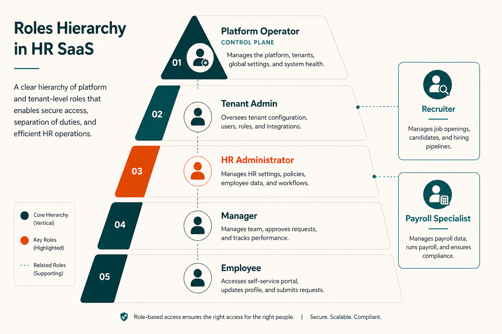

# Roles and Permissions

Who does what in Social HR — across the [platform control plane](./PLATFORM.md) and customer HR workspaces.

Social HR uses role-based access within each workspace. Permissions are assigned through employee records, user groups, and individual permission settings. There are no separate product SKUs for roles.

> **At a glance**
>
> | Role | Surface | Scope |
> |------|---------|-------|
> | [Platform operator](#platform-operator) | [Control plane](./GLOSSARY.md#platform-terms) | Manage tenants, plans, status |
> | [Tenant admin](#tenant-admin) | Customer workspace | Full org + settings |
> | [HR administrator](#hr-administrator) | Customer workspace | People operations |
> | [Manager](#manager) | Customer workspace | Approvals + team visibility |
> | [Employee](#employee) | Customer workspace | Self-service |
> | [Recruiter](#recruiter) / [Payroll specialist](#payroll-specialist) | Customer workspace | Module specialists |

Scenarios by persona: [Use Cases](./USE_CASES.md).

---

## Platform operator

**Where:** [Control plane](./GLOSSARY.md#platform-terms) dashboard on Social HR's primary domain.

**Who:** Social HR staff with platform access credentials.

### Responsibilities

| Area | Actions |
|------|---------|
| **[Tenant](./GLOSSARY.md#platform-terms) lifecycle** | Create, view, edit, suspend, reactivate, delete customer workspaces |
| **[Plan](./PLANS.md) management** | Assign and change subscription plans |
| **[Module overrides](./GLOSSARY.md#platform-terms)** | Force specific modules on or off for individual customers |
| **Account status** | Set trial, active, past due, suspended, cancelled |
| **Support access** | Open customer workspaces for verification and troubleshooting |
| **Catalog management** | View plans and module catalog |

### What platform operators cannot do

- Log into customer workspaces with their platform credentials (separate login required)
- View customer HR data (employees, payslips, attendance) from the control plane
- Modify customer organization settings directly

### Typical permissions

Platform staff access is granted through staff credentials on the primary domain — separate from any customer workspace user account.

Scenarios: [Use Cases — Platform operator](./USE_CASES.md#platform-operator-scenarios). Detail: [Platform — Control plane](./PLATFORM.md#control-plane).

---

## Tenant admin

**Where:** Customer HR workspace.

**Who:** The organization's primary HR technology administrator — often the first user created during [provisioning](./GLOSSARY.md#platform-terms).

### Responsibilities

| Area | Actions |
|------|---------|
| **Organization setup** | Departments, job positions, [work types](./GLOSSARY.md#workforce-visibility-terms), shifts, holidays |
| **Policy configuration** | [Geofencing](./MODULES.md#geofencing), [face check-in](./MODULES.md#face-check-in), [activity tracking](./MODULES.md#activity-tracking), attendance rules |
| **User management** | Create users, assign permission groups, manage employee permissions |
| **Mail configuration** | Organization email server settings |
| **Module settings** | Configure all entitled [modules](./MODULES.md) (payroll tax, leave types, recruitment stages, etc.) |
| **Integrations** | LDAP, biometric devices, backup settings (when entitled) |
| **Initial data** | Import employees, set up org chart, configure approval chains |

### Typical permissions

Full access to Settings, Configuration, and all entitled modules. Can grant or revoke permissions for other users.

Scenarios: [Use Cases — Tenant HR admin](./USE_CASES.md#tenant-hr-admin-scenarios).

---

## HR administrator

**Where:** Customer HR workspace.

**Who:** HR team members responsible for people operations — may or may not also hold [tenant admin](#tenant-admin) permissions.

### Responsibilities

| Area | Actions |
|------|---------|
| **Employee records** | Create, update, deactivate employees; manage work information |
| **Leave administration** | Configure leave types, allocate balances, manage company leaves |
| **Attendance oversight** | Review attendance records, configure grace times and IP restrictions |
| **Recruitment** | Manage drives, candidates, and pipeline (when entitled) |
| **Onboarding** | Manage new-hire task boards (when entitled) |
| **Offboarding** | Manage exit processes (when entitled) |
| **Documents** | Request and track employee documents |
| **Announcements** | Post organization-wide announcements |
| **Policy documents** | Distribute and track employee policy acknowledgments |
| **Reports** | Access dashboard analytics and module reports |

### Typical permissions

Broad access to HR modules. May or may not have Settings access depending on organization policy. Usually cannot manage user permissions unless explicitly granted.

Module reference: [Modules](./MODULES.md).

---

## Manager

**Where:** Customer HR workspace.

**Who:** Employees with direct reports — identified through the **reporting manager** relationship on employee records.

### Responsibilities

| Area | Actions |
|------|---------|
| **Approvals** | Leave requests, attendance requests, [work type requests](./GLOSSARY.md#workforce-visibility-terms), shift requests, asset requests, overtime |
| **[Attendance validation](./GLOSSARY.md#attendance-and-pay-terms)** | Review and validate team attendance records |
| **Activity review** | Classify [review segments](./GLOSSARY.md#workforce-visibility-terms) (Paid / Unpaid / Meeting) for direct reports |
| **Team visibility** | View team profiles, attendance, leave balances, activity timelines |
| **Performance** | Review objectives, key results, and feedback for direct reports (when entitled) |
| **Recruitment** | Participate in interviews and candidate evaluation (when assigned) |

### What managers typically cannot do

- Modify organization-wide settings
- Access employees outside their reporting chain (unless granted broader permissions)
- Generate payslips or modify payroll contracts
- Configure geofencing, activity policies, or other system settings

### Typical permissions

Approval queues on [dashboard](./FEATURES.md#dashboard). Team Activity view. Employee profile access for direct reports. Module-specific view permissions.

Scenarios: [Use Cases — Manager](./USE_CASES.md#manager-scenarios).

---

## Employee

**Where:** Customer HR workspace (+ optional [desktop app](./GLOSSARY.md#workforce-visibility-terms)).

**Who:** Every person with a user account in the organization.

### Responsibilities (self-service)

| Area | Actions |
|------|---------|
| **[Attendance](./GLOSSARY.md#attendance-and-pay-terms)** | [Check in and out](../SOCIAL_HR_TERMS_AR.md) daily |
| **[Leave](./GLOSSARY.md#leave-terms)** | Request time off, view balances |
| **Profile** | View and update own personal information |
| **Requests** | Submit attendance corrections, shift changes, work type requests, reimbursements, asset requests |
| **[Face registration](./GLOSSARY.md#workforce-visibility-terms)** | Enroll face templates for check-in verification |
| **Activity** | Run desktop app, view own activity timeline and [productivity score](./GLOSSARY.md#workforce-visibility-terms) |
| **Payslips** | View own payslips (when permitted) |
| **[Helpdesk](./MODULES.md#helpdesk)** | Create support tickets |
| **[Projects](./MODULES.md#projects)** | Log timesheet hours on assigned tasks (when entitled) |
| **[Performance](./MODULES.md#performance-pms)** | Set and track own objectives and key results (when entitled) |

### What employees cannot do

- View other employees' payslips, disciplinary records, or private profile information
- Approve requests (unless also a manager)
- Access admin settings or configuration
- View team activity (unless also a manager)

### Typical permissions

Self-service access to own profile, attendance, leave, and permitted modules. [Quick action](./FEATURES.md#quick-actions) button for common requests.

Scenarios: [Use Cases — Employee](./USE_CASES.md#employee-scenarios).

---

## Recruiter

**Where:** Customer HR workspace ([Recruitment module](./MODULES.md#recruitment)).

**Who:** HR team members or hiring managers focused on talent acquisition.

### Responsibilities

| Area | Actions |
|------|---------|
| **Pipeline management** | Create drives, manage stages, move candidates |
| **Candidate records** | Add candidates, schedule interviews, record outcomes |
| **Assessments** | Use surveys and skill zones |
| **Hiring** | Move candidates to hired status → triggers [onboarding](./MODULES.md#onboarding) |
| **Reporting** | View recruitment analytics on dashboard |

### Typical permissions

Full Recruitment module access. View access to related employee records for hired candidates. May also hold HR admin or manager permissions.

Scenario: [Use Cases — Hire through the pipeline](./USE_CASES.md#hire-through-the-pipeline).

---

## Payroll specialist

**Where:** Customer HR workspace ([Payroll module](./MODULES.md#payroll)).

**Who:** Finance or HR team members responsible for compensation processing.

### Responsibilities

| Area | Actions |
|------|---------|
| **Contracts** | Create and manage employment contracts |
| **Allowances and deductions** | Configure pay components |
| **Payslip generation** | Run monthly or periodic payslip creation |
| **Reimbursements** | Process employee reimbursement requests |
| **Encashments and advances** | Manage leave encashments and salary advances |
| **Tax configuration** | Set up federal tax rules |
| **Validation** | Confirm attendance is validated before payroll runs |

### What payroll specialists typically cannot do

- Modify attendance records directly (validation is manager workflow)
- Change organization settings unrelated to payroll
- Access recruitment or performance modules (unless also granted)

### Typical permissions

Full Payroll module access. View access to employee work information and validated attendance records.

Scenario: [Use Cases — Monthly payslip run](./USE_CASES.md#monthly-payslip-run).

---

## Permission configuration

HR administrators and tenant admins configure permissions through:

| Mechanism | Purpose |
|-----------|---------|
| **Employee permission settings** | Individual permission assignments per employee |
| **User groups** | Role templates (e.g., "HR Team," "Department Managers") applied to multiple users |
| **Module-level permissions** | View, create, change, delete access per module |
| **Reporting manager relationship** | Determines manager approval queues and team visibility |

Permissions are granular — an employee can hold multiple roles (e.g., manager + payroll specialist).

---

## Reporting relationships

The **reporting manager** field on employee work information determines:

- Which approval queues appear on a manager's [dashboard](./FEATURES.md#dashboard)
- Team visibility in Activity, Attendance, and Leave modules
- Performance review assignments

This is separate from project manager roles in the [Projects module](./MODULES.md#projects), which control project-specific access only.

---

## Access during account suspension

When a customer workspace is suspended or cancelled:

- All roles lose access immediately on next interaction
- [Platform operators](#platform-operator) retain control plane access to manage the account
- Data is retained for all roles until workspace deletion

Policy: [Account access](./POLICIES.md#account-access-and-entitlements).

---

## Related documents

- [Use Cases](./USE_CASES.md) — scenarios by persona
- [Platform](./PLATFORM.md) — control plane vs workspace
- [Modules](./MODULES.md) — what each role interacts with
- [Policies](./POLICIES.md) — rules governing access
- [Glossary — Platform terms](./GLOSSARY.md#platform-terms) — role-related definitions
- [How It Works](./HOW_IT_WORKS.md) — workflows by role
